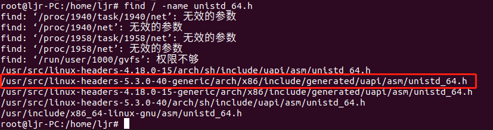
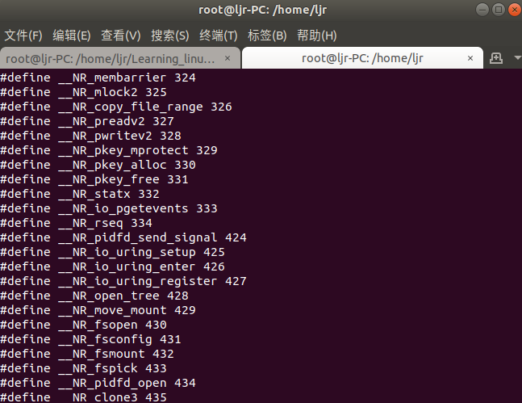
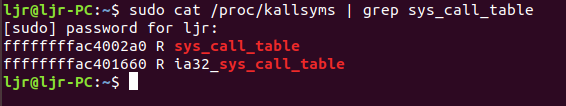
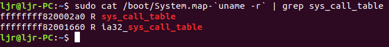
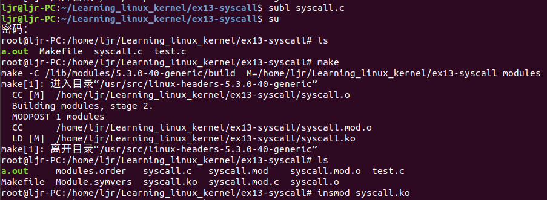
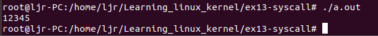
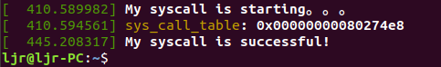

本文将介绍Linux使用内核模块添加系统调用（无需编译内核），思路就是修改映射在内存中的系统调用表，把一个空闲的系统调用表项指向自己写的模块中的函数，如果是已使用的表项，甚至可以实现系统调用劫持。
## 1、查看预留系统调用号
不同内核版本，文件位置有所不同，我们可以直接查找`unistd_64.h`文件，命令如下：
```bash
sudo find / -name unistd_64.h
```


```bash
sudo cat /usr/src/linux-headers-5.3.0-40-generic/arch/x86/include/generated/uapi/asm/unistd_64.h
```


其中找到系统调用号335空闲，我们选择此系统调用号来编写内核模块。

## 2、获取系统调用表 `sys_call_table` 的虚拟地址
### 方法一：使用/proc/kallsyms
`kallsyms`包含了`kernel image`和动态加载模块的符号表，包括内核中的函数符号(包括没有`EXPORT_SYMBOL`导出的符号)、全局变量(用`EXPORT_SYMBOL`导出的全局变量)，函数如果被编译器内联（inline）或优化掉，则它在`/proc/kallsyms`有可能找不到。此方法由变量名获取虚拟地址使用如下命令：

```bash
sudo cat /proc/kallsyms | grep sys_call_table
```

可以看到系统调用表 `sys_call_table` 的虚拟地址为`ffffffffac4002a0`，通过R标志可以看出它是只读的。在代码中可以使用`kallsyms_lookup_name()`函数实现，具体使用方法请看内核模块代码。

### 方法二：使用System.map
`System.map`是一份内核符号表`kernel symbol table`，包含了内核中的变量名和函数名地址，在每次编译内核时，自动生成。由变量名获取虚拟地址使用如下命令：
```bash
sudo cat /boot/System.map-`uname -r` | grep sys_call_table
```

可以看到系统调用表 `sys_call_table` 的虚拟地址为`ffffffff820002a0`，与方法一获得的虚拟地址不同，这是因为正在运行的内核可能和System.map不匹配，出现`System.map does not match actual kernel`，`/proc/kallsyms`中增加的函数符号是后来安装程序中引入的，而`system.map`仅仅是kenrel编译时生成的符号表,所以`/proc/kallsyms`才是参考的主要来源，一般通过`/proc/kallsyms`获得符号的地址。

### 方法三：使用`kallsyms_lookup_name()`函数

具体用法见下面的程序。

## 3、内核模块代码
为了修改内存中的表项，还要修改寄存器写保护位。内核模块代码和详细注释如下，：
```c
#include <linux/module.h>
#include <linux/kernel.h>
#include <linux/init.h>
#include <linux/unistd.h>
#include <linux/time.h>
#include <asm/uaccess.h>
#include <linux/sched.h>
#include <linux/kallsyms.h>

#define __NR_syscall 335	/* 系统调用号335 */
unsigned long * sys_call_table;

unsigned int clear_and_return_cr0(void);
void setback_cr0(unsigned int val);
static int sys_mycall(void);

int orig_cr0;	/* 用来存储cr0寄存器原来的值 */
unsigned long *sys_call_table = 0;
static int (*anything_saved)(void);	/*定义一个函数指针，用来保存一个系统调用*/
/*
 * 设置cr0寄存器的第17位为0
 */
unsigned int clear_and_return_cr0(void)	
{
   	unsigned int cr0 = 0;
   	unsigned int ret;
    /* 前者用在32位系统。后者用在64位系统，本系统64位 */
    //asm volatile ("movl %%cr0, %%eax" : "=a"(cr0));	
   	asm volatile ("movq %%cr0, %%rax" : "=a"(cr0));	/* 将cr0寄存器的值移动到rax寄存器中，同时输出到cr0变量中 */
    ret = cr0;
	cr0 &= 0xfffeffff;	/* 将cr0变量值中的第17位清0，将修改后的值写入cr0寄存器 */
	//asm volatile ("movl %%eax, %%cr0" :: "a"(cr0));
	asm volatile ("movq %%rax, %%cr0" :: "a"(cr0));	/* 读取cr0的值到rax寄存器，再将rax寄存器的值放入cr0中 */
	return ret;
}

/* 读取val的值到rax寄存器，再将rax寄存器的值放入cr0中 */
void setback_cr0(unsigned int val)
{	

	//asm volatile ("movl %%eax, %%cr0" :: "a"(val));
	asm volatile ("movq %%rax, %%cr0" :: "a"(val));
}

/* 添加自己的系统调用函数 */
static int sys_mycall(void)
{
	int ret = 12345;
	printk("My syscall is successful!\n");
	return ret;
}

/*模块的初始化函数，模块的入口函数，加载模块*/
static int __init init_addsyscall(void)
{
	printk("My syscall is starting。。。\n");
	sys_call_table = (unsigned long *)kallsyms_lookup_name("sys_call_table");	/* 获取系统调用服务首地址 */
   	printk("sys_call_table: 0x%p\n", sys_call_table);
	anything_saved = (int(*)(void))(sys_call_table[__NR_syscall]);	/* 保存原始系统调用 */
	orig_cr0 = clear_and_return_cr0();	/* 设置cr0可更改 */
	sys_call_table[__NR_syscall] = (unsigned long)&sys_mycall;	/* 更改原始的系统调用服务地址 */
	setback_cr0(orig_cr0);	/* 设置为原始的只读cr0 */
	return 0;
}

/*出口函数，卸载模块*/
static void __exit exit_addsyscall(void)
{
 	orig_cr0 = clear_and_return_cr0();	/* 设置cr0中对sys_call_table的更改权限 */
    sys_call_table[__NR_syscall] = (unsigned long)anything_saved;	/* 设置cr0可更改 */
    setback_cr0(orig_cr0);	/* 恢复原有的中断向量表中的函数指针的值 */
   	printk("My syscall exit....\n");	/* 恢复原有的cr0的值 */
}

module_init(init_addsyscall);
module_exit(exit_addsyscall);
MODULE_LICENSE("GPL");

```
要注意，不同版本系统，所用的汇编语句不同，现在将用到的汇编语句总结如下：
**常见寄存器：**
|寄存器|16位|32位|64位|
|--|--|--|--|
|累加寄存器|AX|	EAX|	RAX|
|基址寄存器	|BX|	EBX	|RBX|
|计数寄存器	|CX|	ECX|	RCX|
|数据寄存器|	DX|EDX	|RDX|
|堆栈基指针|	BP	|EBP|	RBP|
|变址寄存器	|SI|	ESI|	RSI|
|堆栈顶指针	|SP|	ESP|	RSP|
|指令寄存器|	IP|	EIP|	RIP|
**mov用法:** movb（8位）、movw（16位）、movl（32位）、movq（64位）
| 寻址方式   | 举例               | 说明                                                         |
| ---------- | ------------------ | ------------------------------------------------------------ |
| 寄存器寻址 | movl %eax, %edx    | eax -> edx                                                   |
| 立即数寻址 | movl $0x123, %edx  | 数字->寄存器                                                 |
| 直接寻址   | movl 0x123, %edx   | 直接访问内存地址数据，edx = (int32_t)0x123;               |
| 间接寻址   | movl (%ebx), %edx  | %ebx 是个内存地址，(%ebx)指的是该地址中的数据，edx = (int32_t)ebx; |
| 变址寻址   | movl 4(%ebx), %edx | edx = *(int32_t*)(ebx+4);                                    |

## 4、Makefile文件
```bash
obj-m:=syscall.o
PWD:= $(shell pwd)
KERNELDIR:= /lib/modules/$(shell uname -r)/build
EXTRA_CFLAGS= -O0

all:
	make -C $(KERNELDIR)  M=$(PWD) modules
clean:
	make -C $(KERNELDIR) M=$(PWD) clean
```
要注意添加`EXTRA_CFLAGS= -O0`关闭gcc优化选项，避免插入模块出错。
## 5、测试程序
```c
#include <syscall.h>
#include <stdio.h>
int main(void)
{
	printf("%d\n",syscall(335));
	return 0;
}
```
## 6、运行结果
编译模块后插入内核，测试结果如下：

运行用户态测试程序，结果如下：

查看系统日志，结果如下：


