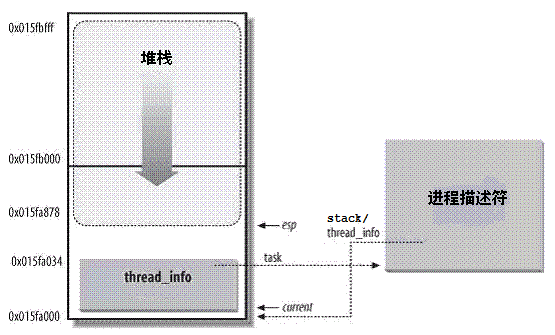

# 前言

为了管理进程，OS必须对每个进程所作的事情进行清楚地描述，OS使用数据结构来代表处理不同的实体，这个数据结构就是通常所说的进程描述符和进程控制块PCB，在linux中，使用<u>task_struct</u>结构体，每个进程都会被分配一个该结构，包含了进程的所有信息。

注：task_struct结构体被定义在<include/linux/sched.h>中

# 结构体成员

1. ##### 进程状态：

   ```c
   	volatile long state;
    //volatile确保本条指令不会因编译器的优化而省略，且要求每次直接读值	
    预定义的状态值：
    /* Used in tsk->state: */
   #define TASK_RUNNING			0x0000 
   //进程要么正在执行，要么准备执行
   #define TASK_INTERRUPTIBLE		0x0001   
   //可中断的睡眠，可以通过一个信号唤醒      
   #define TASK_UNINTERRUPTIBLE		0x0002
   //不可中断的睡眠，不可以通过信号进行唤醒
   #define __TASK_STOPPED			0x0004
   //进程停止执行
   #define __TASK_TRACED			0x0008
   //进程被追踪
   /* Used in tsk->exit_state: */
   #define EXIT_DEAD			0x0010
   //进程的最终状态，进程死亡
   #define EXIT_ZOMBIE			0x0020
   //僵尸状态的进程，表示进程被终止，但是父进程还没有获取它的终止信息，比如进程有没有执行完等信息
   #define EXIT_TRACE			(EXIT_ZOMBIE | EXIT_DEAD)
   /* Used in tsk->state again: */
   #define TASK_PARKED			0x0040
   #define TASK_DEAD			0x0080
   //死亡
   #define TASK_WAKEKILL			0x0100
   //唤醒并杀死的进程
   #define TASK_WAKING			0x0200
   //唤醒进程
   #define TASK_NOLOAD			0x0400
   #define TASK_NEW			0x0800
   #define TASK_STATE_MAX			0x1000
   ```

2. #####  进程标识符：

   ```c
   	pid_t pid;
   	pid_t tgid;
   ```

    		每个进程都有自己的pid，每个线程都有自己的线程id（pthread_t类型），但这是在用户空间的层面，而在内核层面中，线程其实就是进程，所以为了更好区分这些概念，一般使用task来指代内核中的进程概念，依旧用进程来指定用户空间层面的进程。

   ​		那么在内核中，每个线程都是一个task，所以每个线程都有自己的一份task_struct，而且都有自己独特的pid，那么此时tgid是干什么的那？

   ​		答：是用来说明线程是属于哪一个进程的，一个进程就是一个线程组，所以每个进程的所有线程都有着相同的tgid。当程序开始运行的时候，只有一个主线程，这个主线程的tgid就是pid，而当该主线程创建其他线程的时候，就继承了主线程的tgid。

3. #####  进程内核栈：

   ​		当进程通过系统调用陷入内核时，内核代码所使用的栈并不是用户空间中的栈，而是一个内核空间的栈，也就是进程内核栈，它用于支持系统调用中的函数调用和自动变量，还用于保存一些系统调用前的应用信息，如用户空间栈指针、系统调用参数。

   ​		每个进程在创建的时候都会得到一个内核栈空间，内核栈和进程的对应关系是通过2个结构体中的指针成员完成的，其中就有tas_struct：这里的stack指向栈底。

   ```c
   void *stack;
   //通过alloc_thread_info函数分配它的内核栈，通过free_thread_info函数释放所分配的内核栈，具体函数在fork.c中
   ```

   ​		另外一个是thread_info位于<thread.h>中，保存了线程所需的特定处理器的信息， 也就是进程所依赖体系结构的信息，以及通用的task_struct的指针：

   ```c
   /*
    * low level task data that entry.S needs immediate access to.
    * __switch_to() assumes cpu_context follows immediately after cpu_domain.
    */
   struct thread_info {
       unsigned long        flags;        /* low level flags */
       int            preempt_count;    /* 0 => preemptable, <0 => bug */
       mm_segment_t        addr_limit;    /* address limit */
       struct task_struct    *task;        /* main task structure */
       struct exec_domain    *exec_domain;    /* execution domain */
       __u32            cpu;        /* cpu */
       __u32            cpu_domain;    /* cpu domain */
       struct cpu_context_save    cpu_context;    /* cpu context */
       __u32            syscall;    /* syscall number */
       __u8            used_cp[16];    /* thread used copro */
       unsigned long        tp_value;
       struct crunch_state    crunchstate;
       union fp_state        fpstate __attribute__((aligned(8)));
       union vfp_state        vfpstate;
   #ifdef CONFIG_ARM_THUMBEE
       unsigned long        thumbee_state;    /* ThumbEE Handler Base register */
   #endif
       struct restart_block    restart_block;
   };
   
   其中最关键的是task成员，指向的是所创建的进程struct task_struct结构体
   其中的stack成员就是内核栈，也就是说内核栈空间和thread_info是公用一块空间的，
   如果内核栈溢出，thread_info就会被摧毁，系统崩溃
   ```

   ​		上述两个结构体通过<sched.h>中的union thread_union联系在一起，代码如下所示：

   ```c
   union thread_union {
   	 #ifndef CONFIG_ARCH_TASK_STRUCT_ON_STACK
             struct task_struct task;
        #endif
        #ifndef CONFIG_THREAD_INFO_IN_TASK
             struct thread_info thread_info;
        #endif
             unsigned long stack[THREAD_SIZE/sizeof(long)];
     };
     //这块区域在32为系统上是8K=8192，占两个叶框，64位上通常是16K，其实地址必须是8192的整数倍
   架构           THREAD_SIZE               
   x86            arch/x86/include/asm/page_32_types.h, line 21
   x86_64         arch/x86/include/asm/page_64_types.h, line 11
   arm            arch/arm/include/asm/thread_info.h, line 20
   arm64          arch/arm64/include/asm/thread_info.h, line 32
   
   ```

   ​		处于效率考虑，内核让这个union空间占用连续的两个叶框，并让第一个页框的其实地址是213的倍数。下图描述了物理内存中存放两种数据结构的方式，线程描述符驻留在这个内存区的开始，从栈顶末端向下增长。

   

   - esp寄存器：是CPU栈指针，用来存放栈顶单元的地址，在80x86系统中，栈起始于顶端，并朝着这个内存区开始的方向增长从用户态刚切换到内核态后，进程的内核栈总是空的，因此，esp寄存器指向这个栈的顶端，一旦写入数据，esp的值就递减。

   - thread_info和内核栈共用了thread_union结构，但是thread_info大小固定，存在在联合体的开始部分，而内核栈由高地址向低地址拓展，当内核栈的栈顶到达thread_info的存储空间时，则会发生栈溢出。

   - 系统的current指针指向了当前运行进程的thread_union（或者thread_info）结构。

   - 进程task_struct中的stack指向了进程的thread_union（或者thread_info）的地址，在早期的内核中这个指针用struct thread_info *thread_info来表示，在新的内核中用哪个了更浅显的名字 void *stack，即内核栈。

     内核栈的产生：在进程被创建的时候，fork族的系统调用会分别为内核栈和struct task_struct分配空间，调用过程：

     ```c
     fork族的系统调用-->do_fork-->copy_process-->dup_task_struct
     dup_task_struct函数：
     static struct task_struct *dup_task_struct(struct task_struct *orig)
     {
         struct task_struct *tsk;
         struct thread_info *ti;
         unsigned long *stackend;
     
         int err;
     
         prepare_to_copy(orig);
     
         tsk = alloc_task_struct();
         //alloc_task_struct()使用内核的slab分配器去为所要创建的进程分配
         //struct task_struct的空间
         if (!tsk)
             return NULL;
     
         ti = alloc_thread_info(tsk);
         //alloc_thread_info()：使用内核的伙伴系统去为所要创建的进程分配内核栈，
         //也就是union thread_union空间
         if (!ti) {
             free_task_struct(tsk);
             return NULL;
         }
     
          err = arch_dup_task_struct(tsk, orig);
         if (err)
             goto out;
     
         tsk->stack = ti;
     
         err = prop_local_init_single(&tsk->dirties);
         if (err)
             goto out;
     
         setup_thread_stack(tsk, orig);
     ......
     注意：
     后面的tsk->stack = ti;语句，这就是关联了struct task_struct和内核栈
     而在setup_thread_stack(tsk, orig);中，关联了内核栈和struct task_struct：
     static inline void setup_thread_stack(struct task_struct *p, struct task_struct *org)
     {
         *task_thread_info(p) = *task_thread_info(org);
         task_thread_info(p)->task = p;
     }
     ```

     

4. #####  标记：

   ​		反应进程的状态信息，用于内核识别当前的状态

   ```c
   unsigned int flags;	/* per process flags, defined below */
    
    flags成员的可能取值如下：
    #define PF_KSOFTIRQD	0x00000001	/* I am ksoftirqd */
   #define PF_STARTING	0x00000002	/* being created */
   #define PF_EXITING	0x00000004	/* getting shut down */
   #define PF_EXITPIDONE	0x00000008	/* pi exit done on shut down */
   #define PF_VCPU		0x00000010	/* I'm a virtual CPU */
   #define PF_WQ_WORKER	0x00000020	/* I'm a workqueue worker */
   #define PF_FORKNOEXEC	0x00000040	/* forked but didn't exec */
   #define PF_MCE_PROCESS  0x00000080      /* process policy on mce errors */
   #define PF_SUPERPRIV	0x00000100	/* used super-user privileges */
   #define PF_DUMPCORE	0x00000200	/* dumped core */
   #define PF_SIGNALED	0x00000400	/* killed by a signal */
   #define PF_MEMALLOC	0x00000800	/* Allocating memory */
   #define PF_USED_MATH	0x00002000	/* if unset the fpu must be initialized before use */
   #define PF_FREEZING	0x00004000	/* freeze in progress. do not account to load */
   #define PF_NOFREEZE	0x00008000	/* this thread should not be frozen */
   #define PF_FROZEN	0x00010000	/* frozen for system suspend */
   #define PF_FSTRANS	0x00020000	/* inside a filesystem transaction */
   #define PF_KSWAPD	0x00040000	/* I am kswapd */
   #define PF_OOM_ORIGIN	0x00080000	/* Allocating much memory to others */
   #define PF_LESS_THROTTLE 0x00100000	/* Throttle me less: I clean memory */
   #define PF_KTHREAD	0x00200000	/* I am a kernel thread */
   #define PF_RANDOMIZE	0x00400000	/* randomize virtual address space */
   #define PF_SWAPWRITE	0x00800000	/* Allowed to write to swap */
   #define PF_SPREAD_PAGE	0x01000000	/* Spread page cache over cpuset */
   #define PF_SPREAD_SLAB	0x02000000	/* Spread some slab caches over cpuset */
   #define PF_THREAD_BOUND	0x04000000	/* Thread bound to specific cpu */
   #define PF_MCE_EARLY    0x08000000      /* Early kill for mce process policy */
   #define PF_MEMPOLICY	0x10000000	/* Non-default NUMA mempolicy */
   #define PF_MUTEX_TESTER	0x20000000	/* Thread belongs to the rt mutex tester */
   #define PF_FREEZER_SKIP	0x40000000	/* Freezer should not count it as freezable */
   #define PF_FREEZER_NOSIG 0x80000000	/* Freezer won't send signals to it */
   ```

   | 状态          | 描述                           |
   | ------------- | ------------------------------ |
   | PF_FORKNOEXEC | 表示进程刚被创建，但还没有执行 |
   | PF_SUPERPRIV  | 表示进程拥有超级用户特权       |
   | PF_SIGNALED   | 表示进程被信号杀出             |
   | PF_EXITING    | 表示进程开始关闭               |

   

5. #####  进程亲属关系的成员：

   ```c
   	struct task_struct *real_parent; /* real parent process */
   //real_parent指向父进程，如果创建它的父进程不在存在，则指向PID为1的init进程
    	struct task_struct *parent; /* recipient of SIGCHLD, wait4() reports */
   //parent指向父进程，当它终止时，必须向父进程发送信号，通常与real_parent相同
    	struct list_head children;	/* list of my children */
   //表示链表的头部，链表中的所有元素都是他的子进程
   	struct list_head sibling;	/* linkage in my parent's children list */
   //sibling用于把当前进程插入到兄弟链表中
    	struct task_struct *group_leader;	/* threadgroup leader */
   //group_leader指向其所在进程组的领头进程
   ```

6. #####  ptrace系统调用：

   ```c
   	unsigned int ptrace;
   	struct list_head ptraced;
   	struct list_head ptrace_entry;
   	unsigned long ptrace_message;
   	siginfo_t *last_siginfo; /* For ptrace use.  */
   #ifdef CONFIG_HAVE_HW_BREAKPOINT
   	atomic_t ptrace_bp_refcnt;
   #endif
   
   成员ptrace被设置为0时，表示不需要被追踪，可能的取值有：
   /* linux-2.6.38.8/include/linux/ptrace.h */
   #define PT_PTRACED	0x00000001
   #define PT_DTRACE	0x00000002	/* delayed trace (used on m68k, i386) */
   #define PT_TRACESYSGOOD	0x00000004
   #define PT_PTRACE_CAP	0x00000008	/* ptracer can follow suid-exec */
   #define PT_TRACE_FORK	0x00000010
   #define PT_TRACE_VFORK	0x00000020
   #define PT_TRACE_CLONE	0x00000040
   #define PT_TRACE_EXEC	0x00000080
   #define PT_TRACE_VFORK_DONE	0x00000100
   #define PT_TRACE_EXIT	0x00000200
   ```

   

7. #####  Performance Event：是随着linux内核代码一同发布和维护的性能诊断工具

   ```c
   #ifdef CONFIG_PERF_EVENTS
   	struct perf_event_context *perf_event_ctxp[perf_nr_task_contexts];
   	struct mutex perf_event_mutex;
   	struct list_head perf_event_list;
   #endif
   参考网站：
   http://www.ibm.com/developerworks/cn/linux/l-cn-perf1/index.html?ca=drs-#major1
       https://www.ibm.com/developerworks/cn/linux/l-cn-perf2/index.html?ca=drs-#major1
   ```

   

8. #####  进程调度

   ```c
   	int prio, static_prio, normal_prio;
    //prio用于保存动态优先级
    //static_prio用于保存静态优先级，可以通过nice系统调用来进行修改
    //normal_prio的值取决于静态优先级和调度策略
   
    	unsigned int rt_priority;
    //用于保存实时优先级
   
    	const struct sched_class *sched_class;
    //内核抽象出一个调度类(struct sched_class)，它只是向调度器声明一组函数指针，
    //不同的类各自去实现，由调度器统一调度
   //内核中的调度类有：
   /* linux-2.6.38.8/kernel/sched_fair.c */ 
   static const struct sched_class fair_sched_class;
   /* linux-2.6.38.8/kernel/sched_rt.c */
   static const struct sched_class rt_sched_class;
   /* linux-2.6.38.8/kernel/sched_idletask.c */
   static const struct sched_class idle_sched_class;
   /* linux-2.6.38.8/kernel/sched_stoptask.c */
   static const struct sched_class stop_sched_class;
   
   	struct sched_entity se;
    //使用cfs调度，一般是普通进程使用
   
    	struct sched_rt_entity rt;
   //使用rt调度，一般是实时进程调用
   //注意：se和rt都是调用实体，每个进程都有其中之一的实体
      	unsigned int policy;
    //表示进程的调度策略，主要有：
    #define SCHED_NORMAL		0  //用于普通进程，通过cfs调度器实现
   #define SCHED_FIFO		1          //先入先出调度算法，实时调度策略
   #define SCHED_RR		2          //轮转调度算法，也是实时调度策略
   #define SCHED_BATCH		3  //用户非交互的处理器消耗型进程
   /* SCHED_ISO: reserved but not implemented yet */
   #define SCHED_IDLE		5         //在系统负载很低时使用
   
    	cpumask_t cpus_allowed;
   //用户控制进程可以在那个处理器上运行
   ```

   ​		实时优先级是0到MAX_RT_PRIO-1（即99），而普通进程的优先级范围是从MAX_RT_PRIO到MAX_PRIO-1（即100到139），值越大静态优先级越低.

   ```c
   /* linux-2.6.38.8/include/linux/sched.h */
   #define MAX_USER_RT_PRIO	100
   #define MAX_RT_PRIO		MAX_USER_RT_PRIO
    
   #define MAX_PRIO		(MAX_RT_PRIO + 40)
   #define DEFAULT_PRIO		(MAX_RT_PRIO + 20)
   ```

   

9. #####  时间数据：

   ​		一个进程从创建到终止叫做进程的生存期，进程在其生存期内使用CPU时间，内核都需要进行记录，进程耗费的时间分为两部分，一部分是用户模式下耗费的时间，一部分是在系统模式下耗费的时间。

   ```c
   cputime_t utime, stime, utimescaled, stimescaled;
       cputime_t gtime;
       cputime_t prev_utime, prev_stime;//记录当前的运行时间（用户态和内核态）
       unsigned long nvcsw, nivcsw; //自愿/非自愿上下文切换计数
       struct timespec start_time;  //进程的开始执行时间    
       struct timespec real_start_time;  //进程真正的开始执行时间
       unsigned long min_flt, maj_flt;
       struct task_cputime cputime_expires;//cpu执行的有效时间
       struct list_head cpu_timers[3];//用来统计进程或进程组被处理器追踪的时间
       struct list_head run_list;
       unsigned long timeout;//当前已使用的时间（与开始时间的差值）
       unsigned int time_slice;//进程的时间片的大小
       int nr_cpus_allowed;
   ```

   

10. #####  文件系统信息:

    ```c
    /* filesystem information */
        struct fs_struct *fs;//文件系统的信息的指针
    /* open file information */
        struct files_struct *files;//打开文件的信息指针
    ```

    

11. #####  信号处理信息：

    ```c
    /* Signal handlers: */
        struct signal_struct            *signal;
    //指向进程信号描述符
        struct sighand_struct           *sighand;
    //指向进程信号处理程序描述符
        sigset_t                        blocked;
        sigset_t                        real_blocked;
    //阻塞信号的掩码
    /* Restored if set_restore_sigmask() was used: */
        sigset_t                        saved_sigmask;
        struct sigpending               pending;
    //进程上还需要处理的信号
        unsigned long                   sas_ss_sp;
    //信号处理程序备用堆栈的地址
        size_t                          sas_ss_size;
    //信号处理程序的堆栈的地址
        unsigned int                    sas_ss_flags;
    
    ```

# 结语

​		task_struct中有非常多的成员，这仅仅是其中的一部分，随着学习的不断深入，会接触和学习更多的结构体成员。