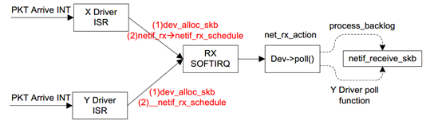
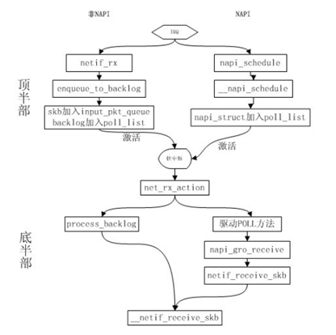
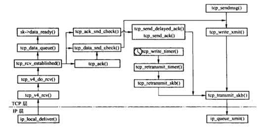
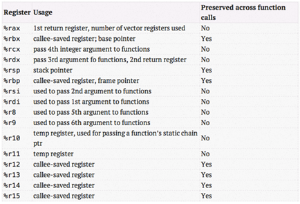

> tcp丢包分析系列文章代码来自谢宝友老师，由西邮陈莉君教授研一学生进行解析，本文由戴君毅整理，梁金荣编辑，贺东升校对。


继续分析实验，上回说到了`kprobe`机制，说完机制自然要再说说策略，也就是实验里对`pre_handler`的实验，这才是本质内容。本实验总共对4个地方添加了`kprobe`钩子：

```c
static struct kprobe kprobe_eth_type_trans;

static struct kprobe kprobe_napi_gro_receive;

static struct kprobe kprobe___netif_receive_skb_core;

static struct kprobe kprobe_tcp_v4_rcv;
```

为了深刻理解实验，我们要知道这些函数的作用以及所在层次。这四个函数的层次是自底向上递增的，那么先看第一个函数 `eth_type_trans`：



当一个包中断到来，驱动ISR响应，首先会调用dev_alloc_skb来生成一个SKB，随后就要调用eth_type_trans来获取包的协议填充到这个SKB中，内核注释一句话解释：

```c
/**
 * eth_type_trans - determine the packet's protocol ID.
 * @skb: received socket data
 * @dev: receiving network device
 *
 * The rule here is that we
 * assume 802.3 if the type field is short enough to be a length.
 * This is normal practice and works for any 'now in use' protocol.
 */
__be16 eth_type_trans(struct sk_buff *skb, struct net_device *dev)
```

为什么要填充它的`protocol`呢？因为驱动接收包后就中断，随后进入哪条处理路径完全取决于`protocol`。根据上图，完成`dev_alloc_skb`以及`eth_type_trans`随后会调用`netif_rx`（或者`netif_rx_schedule`，随后讲解）触发软中断，`ISR`返回。之后软中断调用`process_backlog`中的`poll`函数，最终`netif_receive_skb`会调用`deliver_skb`将报文传递给相应的协议处理函数，即这就是协议栈的入口函数，实际会调用`__netif_receive_skb`，也是我们第三个添加`kprobe`钩子的函数，`-core`后缀表明它是在特定场景（忽略XDP等）使用的简单版本。

那么第二个函数`napi_gro_receive`是什么？看过内核网络的老板们都应该听说过`NAPI`，我这里简单说下方便大家理解。综合整个收包逻辑，大致可以分为以下两种方式：

a.每个数据包到来即中断CPU，由CPU调度中断处理程序进行收包处理，收包逻辑又分为上半部和下半部，核心的协议栈处理逻辑在下半部完成。

b.数据包到来，中断CPU，CPU调度中断处理程序并且关闭中断响应，调度下半部不断轮询网卡，收包完毕或者达到一个阀值后，重新开启中断。

方式a就是上图讲述的过程，而方式b是`Linux NAPI`采用的方式。NAPI是中断与轮询的结合，可以想象，数据量很低与很高时，NAPI可以分别发挥中断与轮询方式的优点，性能较好。如果数据量不稳定，则NAPI则会在两种方式切换上消耗不少时间，效率反而较低一些。下面这个图显示了NAPI过程和传统过程的对比：



可以看到napi_gro_receive 可以就是NAPI方式处理POLL后的事宜。GRO也是一种合并各种包一起接收的技术，这里不展开了，参考https://lwn.net/Articles/358910/。

**tcp_v4_rcv** 则是比较上层的函数了，层次如图所示：



回到实验，来看`pre_handler`实现，这里截取两个：

```c
static int kprobe_eth_type_trans_pre(struct kprobe *p, struct pt_regs *regs)
{
	struct sk_buff *skb = (void *)regs->di;
	struct iphdr *iphdr;

	if (!drop_packet_activated)
		return 0;

	iphdr = (struct iphdr *)(skb->data + ETH_HLEN);
	trace_packet(skb, iphdr, ETH_RECV);

	return 0;
}

static int kprobe_napi_gro_receive_pre(struct kprobe *p, struct pt_regs *regs)
{
	struct sk_buff *skb = (void *)regs->si;
	struct iphdr *iphdr;

	if (!drop_packet_activated)
		return 0;

	if (skb->protocol != cpu_to_be16(ETH_P_IP))
		return 0;

	iphdr = (struct iphdr *)skb->data;
	trace_packet(skb, iphdr, GRO_RECV);

	return 0;
}
```

第一行函数其实看起来就有点懵，这其实是遵守了X86-64的ABI，来获取函数的参数。什么意思？在函数调用过程中，寄存器`pt_regs`保存了函数的参数列表，X86-64的约定如下：



当参数少于7个时， 参数从左到右放入寄存器: rdi, rsi, rdx, rcx, r8, r9。

当参数为7个以上时， 前 6 个与前面一样， 但后面的依次从 “右向左” 放入栈中。

例如：

**H(a, b, c, d, e, f, g, h);**

**a->%rdi, b->%rsi, c->%rdx, d->%rcx, e->%r8, f->%r9**

**h->8(%esp)**

**g->(%esp)**

**call H**

所以，第一个语句`struct sk_buff *skb = (void *)regs->di;` 其实就是拿到函数`eth_type_trans`的第一个参数，即一个skb。`eth_type_trans`前面说过是在驱动中完成的，所以它拿到SKB的data还是指在MAC报头的，所以`pre_handler`需要将`skb->data`加一个以太网报头长度`ETH_HLEN`（实际上是14）的长度变成IP报头。而`kprobe_napi_gro_receive`的`pre_handler`则需要从rsi中取得SKB，因为`napi_gro_receive`中第二个参数接收SKB。

```c
gro_result_t napi_gro_receive(struct napi_struct *napi, struct sk_buff *skb)
{
	gro_result_t ret;

	skb_mark_napi_id(skb, napi);
	trace_napi_gro_receive_entry(skb);

	skb_gro_reset_offset(skb);

	ret = napi_skb_finish(dev_gro_receive(napi, skb), skb);
	trace_napi_gro_receive_exit(ret);

	return ret;
}
EXPORT_SYMBOL(napi_gro_receive);
```

最后的任务就是实现`trace_packet`了：

```c
static void trace_packet(const struct sk_buff *skb,
	const struct iphdr *iphdr, enum packet_footprint fp)
{
	int source = 0;
	int dest = 0;
	struct conn_desc *conn_desc;

	if (fp >= TRACK_COUNT)
		return;

	if (iphdr->protocol == IPPROTO_UDP)
	{
		struct udphdr *uh;

		uh = (void *)iphdr + iphdr->ihl * 4;
		source = be16_to_cpu(uh->source);
		dest = be16_to_cpu(uh->dest);
	}
	else if (iphdr->protocol == IPPROTO_TCP)
	{
		struct tcphdr *th;

		th = (void *)iphdr + iphdr->ihl * 4;
		source = be16_to_cpu(th->source);
		dest = be16_to_cpu(th->dest);
	} else
		return;

	conn_desc = find_alloc_desc(iphdr->protocol,
		iphdr->saddr, source, iphdr->daddr, dest);
	if (!conn_desc)
		return;

	atomic64_inc(&conn_desc->packages[fp]);
}
```

可以看到主要还是为了根据报头获取源地址和目标地址的信息，也是本实验的目的所在。函数重点在`find_alloc_desc`上，这是用户态自己实现的不是内核函数，留到下一篇文章吧。
