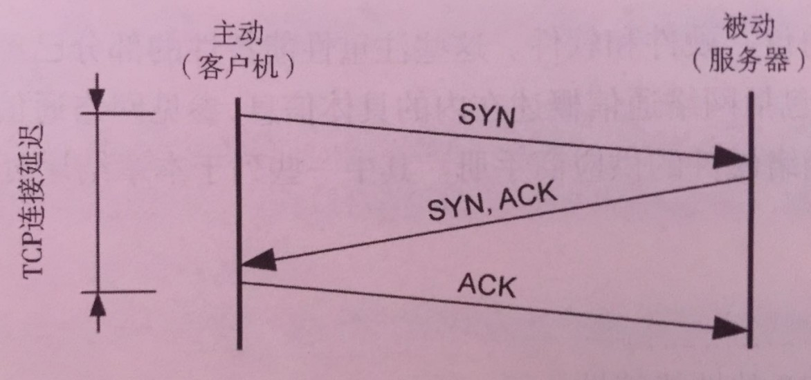
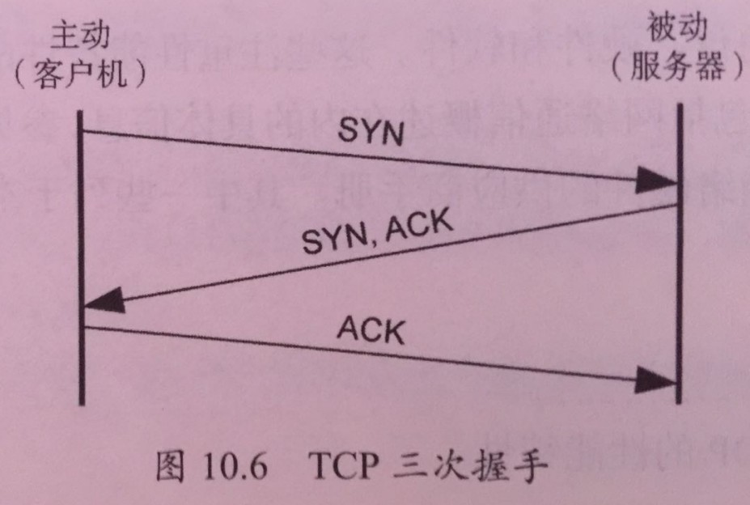

## 什么tcp连接延时

连接延时是传输任何数据前建立网络连接所需的时间。对于tcp连接延时，这就是tcp握手时间。从客户端测量，它是从发送syn到接收到响应的syn-ack的时间。连接延时也许更多的时候被称作连接建立延时，以清晰的地区别连接周期。

注意：连接生命周期指一个网络连接从建立到关闭所需的时间。一些协议支持长连接策略因而之后的操作可以利用现有的连接，进而避免这种系统开销以及建立连接的延时。

tcp连接延时如下图所示：



## tcp三次握手原理和状态转换

首先看下，在内核网络中tcp套接字的状态如下源码所示：

```c
enum {
	TCP_ESTABLISHED = 1,	//连接建立完成
	TCP_SYN_SENT,			//客户端发生tcp连接的中间的状态
	TCP_SYN_RECV,			//服务端发生tcp连接的中间的状态
	TCP_FIN_WAIT1,			//客户端发生tcp断开的中间的状态1
	TCP_FIN_WAIT2,			//客户端发生tcp断开的中间的状态2
	TCP_TIME_WAIT,			//客户端发生tcp断开的中间的状态3
	TCP_CLOSE,				//tcp完全断开的时候状态（初始状态和关闭完成的状态）
	TCP_CLOSE_WAIT,			//服务端发现客户端发生tcp断开的中间的状态
	TCP_LAST_ACK,			//服务端发生tcp断开的中间状态
	TCP_LISTEN,				//监听套接字的状态
	TCP_CLOSING,	/* Now a valid state *///当客户端和服务端一起发生tcp断开的中间状态
	TCP_NEW_SYN_RECV,		//这个状态目前还没有了解过

	TCP_MAX_STATES	/* Leave at the end! */
};
```

tcp连接的过程，其实就是tcp三次握手的过程。我们以客户端向服务端发生请求连接的过程为例。

1. 首先，客户端创建的用来连接的套接字的初始状态是**TCP_CLOSE**，当客户端向服务端发生连接请求的时候，会发送一个syn，这个时候客户端的套接字状态由**TCP_CLOSE**转换成**TCP_SYN_SENT**。（第一次的数据包的发送）
2. 服务端监听套接字的状态是**TCP_LISTEN**，当它接收到syn的时候，会创建一个新的套接字，将新的套接字的状态由**TCP_CLOSE**转换成**TCP_SYN_RECV**。然后，发送一个syn-ack。（第二次的数据包的发送）
3. 当客户端收到syn-ack的应答，客户端的套接字状态由**TCP_SYN_SENT**转换成**TCP_ESTABLISHED**。然后，发送一个ack的应答给服务端，服务端收到这个ack的应答，将套接字的状态由**TCP_SYN_RECV**转换成**TCP_ESTABLISHED**。（第三次的数据包的发送）

由上面的三次握手的连接过程可以看出，三次指的就是三次的数据包的发送。如下图所示。



## tcp延时提取的c源码的实现

```c
#include <uapi/linux/ptrace.h>
#include <net/sock.h>
#include <net/tcp_states.h>
#include <bcc/proto.h>
struct info_t {
    u64 ts;
    u32 pid;
    char task[TASK_COMM_LEN];
};
BPF_HASH(start, struct sock *, struct info_t);

/*ipv4 用来保存输出的数据通道*/
struct ipv4_data_t {
    u64 ts_us;
    u32 pid;
    u32 saddr;
    u32 daddr;
    u64 ip;
    u16 dport;
    u64 delta_us;
    char task[TASK_COMM_LEN];
};
BPF_PERF_OUTPUT(ipv4_events);

/*ipv6 用来保存输出的数据通道*/
struct ipv6_data_t {
    u64 ts_us;
    u32 pid;
    unsigned __int128 saddr;
    unsigned __int128 daddr;
    u64 ip;
    u16 dport;
    u64 delta_us;
    char task[TASK_COMM_LEN];
};
BPF_PERF_OUTPUT(ipv6_events);
/*当用户发生连接请求的时候，我们获取到当前的系统时间*/
int trace_connect(struct pt_regs *ctx, struct sock *sk)
{
    u32 pid = bpf_get_current_pid_tgid() >> 32;
    FILTER
    struct info_t info = {.pid = pid};
    info.ts = bpf_ktime_get_ns();
    bpf_get_current_comm(&info.task, sizeof(info.task));
    start.update(&sk, &info);
    return 0;
};

/*当套接字发生由TCP_SYN_SENT转换成TCP_ESTABLISHED的时候，我获取当前的系统时间，然后用之气保存的发生连接请求的时候时间，两者时间差就是客户发生连接请求的延时*/
int trace_tcp_rcv_state_process(struct pt_regs *ctx, struct sock *skp)
{
    // will be in TCP_SYN_SENT for handshake
    if (skp->__sk_common.skc_state != TCP_SYN_SENT)
        return 0;
    // check start and calculate delta
    struct info_t *infop = start.lookup(&skp);
    if (infop == 0) {
        return 0;   // missed entry or filtered
    }
    u64 ts = infop->ts;
    u64 now = bpf_ktime_get_ns();
    u64 delta_us = (now - ts) / 1000ul;
#ifdef MIN_LATENCY
    if ( delta_us < DURATION_US ) {
        return 0; // connect latency is below latency filter minimum
    }
#endif
    // pull in details
    u16 family = 0, dport = 0;
    family = skp->__sk_common.skc_family;
    dport = skp->__sk_common.skc_dport;
    // emit to appropriate data path
    if (family == AF_INET) {
        struct ipv4_data_t data4 = {.pid = infop->pid, .ip = 4};
        data4.ts_us = now / 1000;
        data4.saddr = skp->__sk_common.skc_rcv_saddr;
        data4.daddr = skp->__sk_common.skc_daddr;
        data4.dport = ntohs(dport);
        data4.delta_us = delta_us;
        __builtin_memcpy(&data4.task, infop->task, sizeof(data4.task));
        ipv4_events.perf_submit(ctx, &data4, sizeof(data4));
    } else /* AF_INET6 */ {
        struct ipv6_data_t data6 = {.pid = infop->pid, .ip = 6};
        data6.ts_us = now / 1000;
        bpf_probe_read_kernel(&data6.saddr, sizeof(data6.saddr),
            skp->__sk_common.skc_v6_rcv_saddr.in6_u.u6_addr32);
        bpf_probe_read_kernel(&data6.daddr, sizeof(data6.daddr),
            skp->__sk_common.skc_v6_daddr.in6_u.u6_addr32);
        data6.dport = ntohs(dport);
        data6.delta_us = delta_us;
        __builtin_memcpy(&data6.task, infop->task, sizeof(data6.task));
        ipv6_events.perf_submit(ctx, &data6, sizeof(data6));
    }
    start.delete(&skp);
    return 0;
}
```

探测点

```
b.attach_kprobe(event="tcp_v4_connect", fn_name="trace_connect")
b.attach_kprobe(event="tcp_v6_connect", fn_name="trace_connect")
b.attach_kprobe(event="tcp_rcv_state_process", fn_name="trace_tcp_rcv_state_process")
```

我们探测的内核函数是：

发生连接请求的内核函数：

1. ipv4用的是tcp_v4_connect
2. ipv6用的是tcp_v6_connect

发生**TCP_SYN_SENT**转换成**TCP_ESTABLISHED**的探测函数是：tcp_rcv_state_process


