大家心心念念的陈莉君老师的录播视频来啦，错过直播的同学看过来！《暑期2020“大咖说开源”陈莉君：Linux从入门到深入内核有多远》录播视频发布，电脑访问下方链接或手机扫描二维码观看录播视频：

https://www.bilibili.com/video/BV1MC4y1Y78J

小编已将直播内容进行整理，大家一起来看看吧！

本文作者：陈莉君     编辑：梁金荣

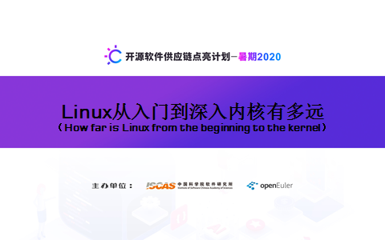

大家晚上好，非常高兴有机会参与由中科院软件所和openEuler 社区共同举办的这项面向高校学生的暑期活动，Linux 内核作为最大的开源社区，其中有150多个国家的近2万顶级开发者参与开发，就像众多作曲家合写了一部经典交响曲，其中蕴含了丰富的精神文化，并以代码的形式呈现给世人。可是，这片森林太过茂密，尽管处处皆是宝，但挖宝的入口并不好找，这20多年来一直在找，总没有找到满意的下手处，今年疫情期间的操作系统在线教学，看到了哈工大李志军老师的视频，他把操作系统设计讲透彻了，在实验楼上的实验也很精彩，但对普通院校的学生来说，依然难度有点大，因此，本学期教学过程中，针对大二学习，Linux零基础，我设计了一系列的实验，其目标是让那些抽象的概念落地有声，学生的精彩作业也不断激活我的思维。

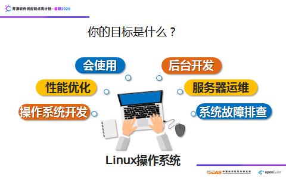

每个人学Linux的目的可能各不相同，仅仅会使用？做后台开发，服务器运维？这三个层面似乎不需要太多深入了解内核，但是，一旦出了问题怎么办？如果想提升性能怎么办？这些都常常会深入到内核。更重要的是，想设计一个操作系统，或者对现有的Linux做一些修改，那必然要深入内核了。

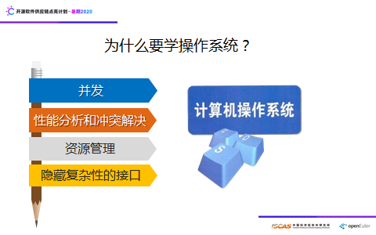

那么，为什么要学操作系呢？事实上，我们已经完全处于并发处理的时代，进程，线程，协程等编程逐渐成为基本技能，其中涉及资源的竞争和共享，死锁等问题的根本原理是OS课程所要讲述的；OS对软硬件的资源管理是它的主要功能，通过对资源管理的学习，可以使大家能够在许多其他场合重用这一模式；当系统或者程序出现性能问题，或者当系统出现冲突时，要深入到系统看看如何进行处理时，对操作系统原理的掌握就显得弥足珍贵。操作系统本身是把复杂和繁琐留给自己，把简单留给用户，这是通过系统调用接口来达到的，这一机制和方式也可以复用到其他场合。

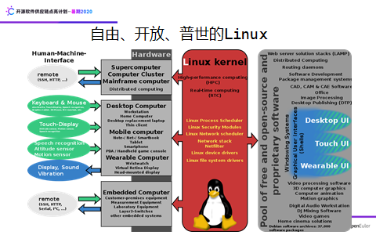

为什么选择Linux操作系统，因为它是自由，开放，几乎适合各个领域，从硬件方面来说，适合嵌入式，可穿戴计算机，移动计算机，桌面，到计算机集群和超级计算机。从应用来说，人工智能，分布式计算，云计算，大数据，区块链到物联网等开源平台都是基于Linux的，从人机接口来说，不但可以通过SSH，HTTP等协议远程访问Linux，还可以通过鼠标，触摸屏，语音识别，姿态感知器，运动感测器，声音震动等与计算机交互。

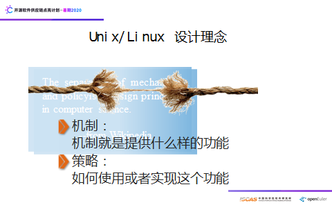

机制与策略分离的设计理念，是计算机科学的基本设计理念，那么什么是机制，什么是策略，机制就是提供什么样的功能，策略就是如何使用或者实现这个功能，比如高考就是一种机制，而你去按高考的规则去参加考试就是一种策略，比如文件系统提供的read（）就是一种机制，你调用read（）函数从磁盘读取数据就是一种策略，如此等等。操作系统课程讲授的是机制还是策略？以讲机制为主，大家能把这些机制应用起来就会有比较大的收获，如果你能设计出一种机制，那就是较大的创新了。

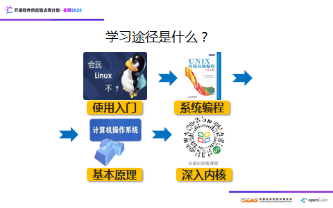

操作系统学习四部曲，首先是入门，先学会玩Linux，使用Linux可以看《鸟哥的Linux私房菜》，系统编程可以看《Unix环境高级编程》，同时我们课程组录制了《Linux编程技术》的慕课，在中国大学慕课上线。核心部分就是操作系统的原理，参考书可以看操作系统的鼻祖Taenbaum写的《现代操作系统》和Three easy Pieces，如果想让所学原理落地，可以同时学习我们课程组在学堂在线录制的《Linux内核分析与应用》慕课，每章都有动手实践的代码，同时参考我编写和翻译的相关书籍，Linux内核学习的资源非常丰富，源代码是第一手资料。但这样的学习途径是唯一的么？本学习的教学打破了这一固有的途径，让这一途径成为一个循环迭代的过程。也可以从操作系统原理入手，向两边延伸。

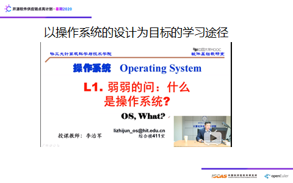

如果以操作系统设计为目标，推荐学习哈东大李治军老师的操作系统视频，我自己曾一口气看了十多集，当你还对Linux内核源代码不熟悉的时候，就看原理部分，当你想把原理落地的时候，就看对0.11源代码的讲解，每一个主题都通过故事的形式把其讲圆了。

本学期的OS教学以系统优化为目标，当这一目标确定下来，操作系统的很多概念就有了抓手，为什么?大家看这张图，对于计算机系统的任何一个部分，都有相应的工具可以查看，比如top命令一上，进程的概念就不用多解释了，尤其是与Windows 的资源管理器一对比，学生立马对命令的强大优势就有了切实的感受，他们自己查阅大量的资料，去认识命令输出的含义，画出的思维导图，精彩纷呈。

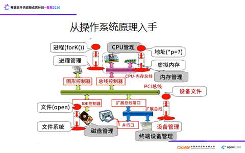

经过这一学期的教学，发现通过操作系统原理入手，以各种工具的使用为把手，让很多抽象的概念都触手可摸，然后一方面，在用户态调用系统调用写代码感受操作系统的强大，另一方面往系统的深处走，初步探究其实现原理，让操作系统的抽象原理变为桥梁，真可谓“一桥飞架南北，天堑（qian）变通途”。

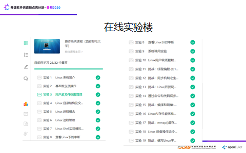

疫情期间的在线教学，如果仅仅讲概念，学生可能在电脑的那边睡着了你也不知道，如何激发大家的潜力，能够触摸到计算机中很多抽象的东西。

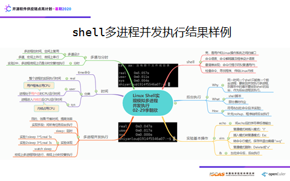

比如并发，就让大家敲了一个5~6行的shell程序，5个进程并发运行，节省时间5倍，结合这个问题，让大家回答6个方面的问题，如图为学生的实验心得。

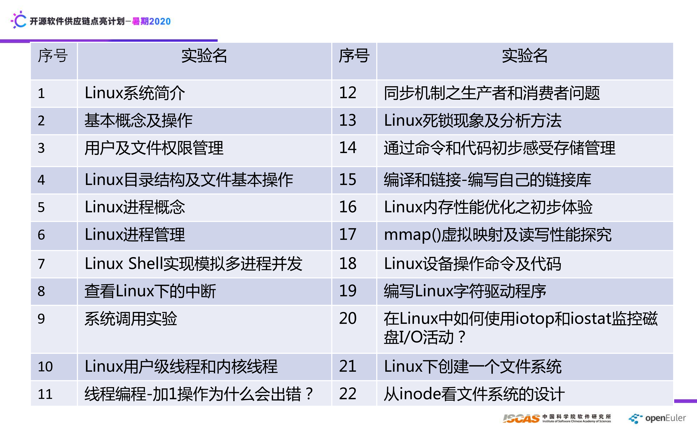

其中的1~6实验为Linux入门，7~22为配合操作系统原理设计的实验，每个实验都会让大家回答5~8个问题，把相关知识关联起来，建立知识之前的网状结构。其中19和22，进入内核，写一个驱动程序和文件系统。

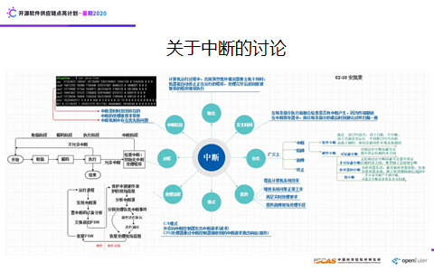

关于中断结合实验，问了7个问题，这是学生的回答。一图抵千字，这张图把关于中断零零散散的知识都穿起来了。

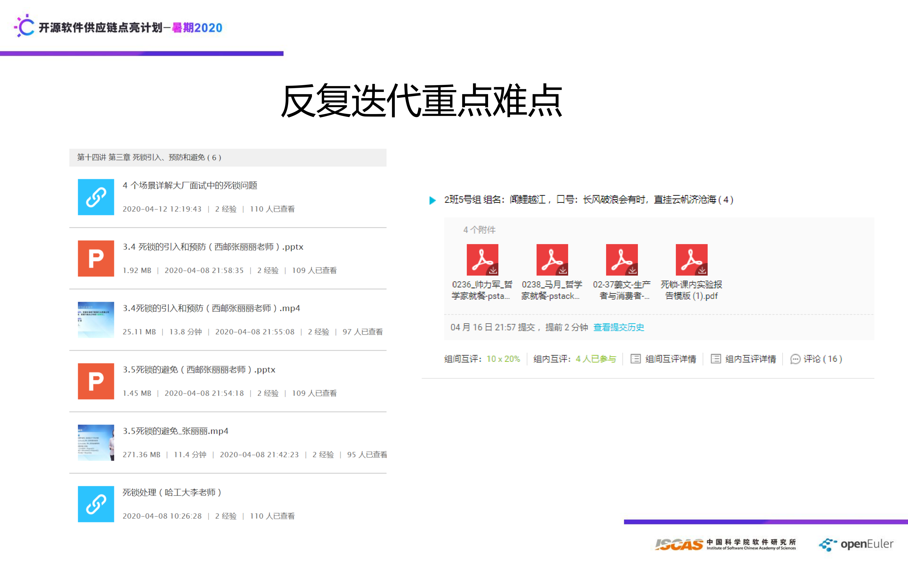

进程、线程、并发作为难点，如何突破，教科书中的生产者-消费者，读者-写者，哲学家就餐等模型一般都是伪代码，今年课程全部用用户态的线程实现，用户态线程库中的函数与内核实现类似，但还是有难度，于是，在死锁实验中，继续用这些代码，并上死锁调试工具pstack、gdb，还有valgrind等三种方式进行调试，这些工具，学生开始很不适应，有一定难度，但还是可控可解的，经过这个过程，学生对解决疑难问题有了初步的体验。

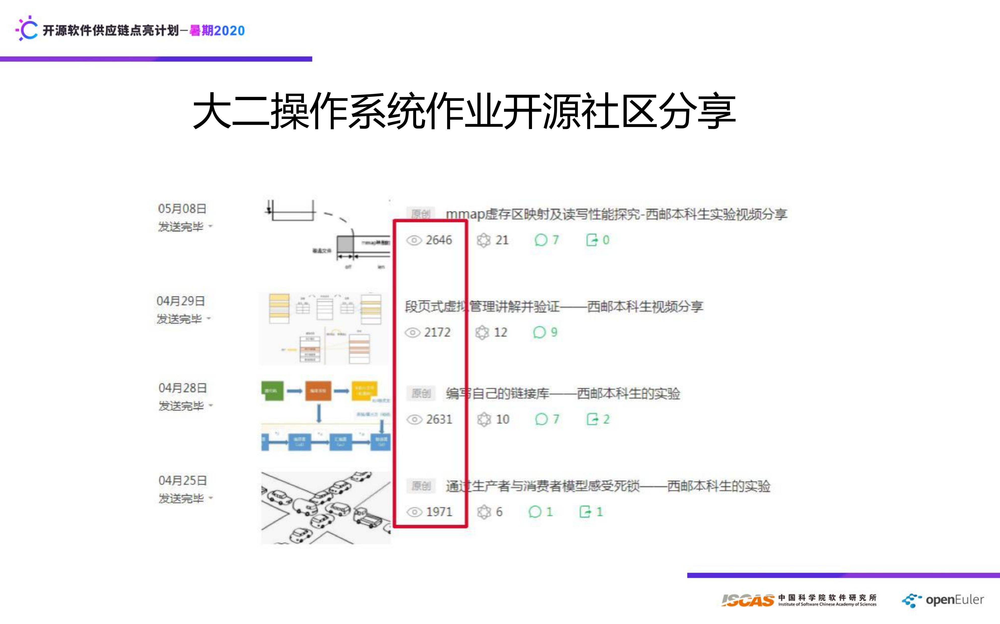

产学研如何结合起来，一直是我想找到的一种途径，但还是比较难，能否把社区作为一种中介呢，今年也做了探索，就是把学生的作业发布于Linux内核之旅社区，作业中的问题立马得到企业一线工程师的反馈，这样就又回馈给学生。比如关于mmap()虚存区映射及读写性能探究的学生讲解视频发布后，立马就有工程师指出问题。

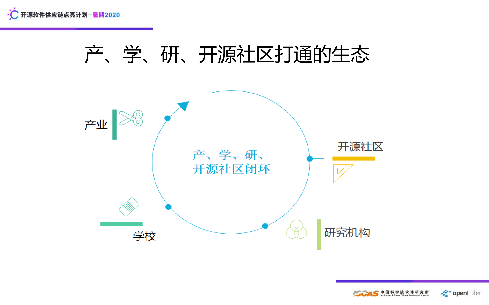

关于产学研开源社区打通的生态，我们在探索中，学生的精彩作业将在Linux内核之旅社区网站、微信公众号、B站发布，暑期2020这样的活动，更是打通产学研社区的一种很好渠道，希望更多的同学参与进来。那么为什么要参与开源社区？

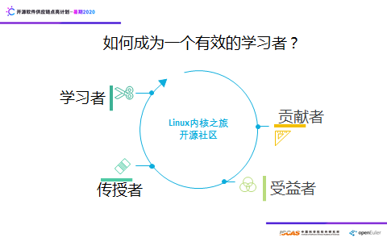

当你一个人学习时，相当于在局部变量中，那么当你把自己所学分享出来，参与到开源社区中，相当于走出局部变量，走向全局变量，这个时候，你就会很容易照见自己的bug，也是角色的切换，从学习者变为一个传授者，受益者变为一个贡献者，会访问到不一样的变量，产生不同的价值，而价值的传递性有一种能量，促使你向更广的全局变量作用域走去。

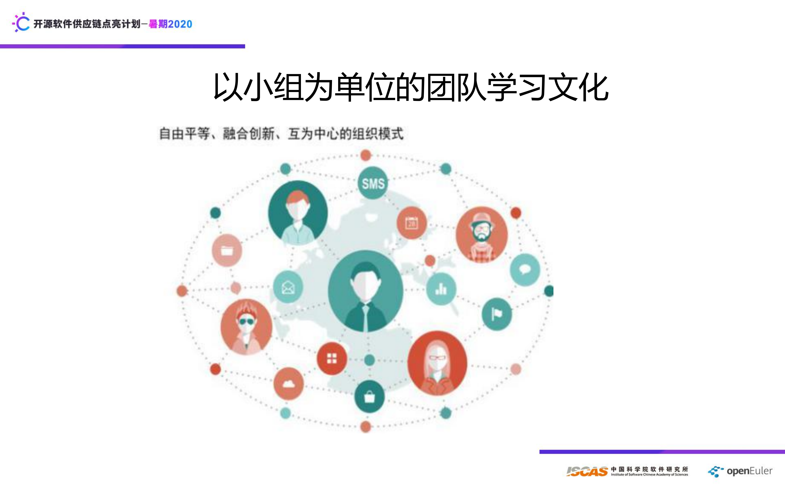

理想的学习组织是什么样的？有一本书叫《重塑组织》，书中讲了五种组织，其中青色组织是目前组织进化的最高阶段， “青色组织” 将组织视作是一个有机生命体，组织中的每一个成员在各自的角色上也是一个完整的有机体。相比其他 “颜色” 的组织，青色组织体现出三大突破：身心完整、进化目标、自我管理。本学期使用云班课管理115位学生，4个人以组为单位，互评互帮，这其中的故事很多，就不一一叙说，总之，团队学习的力量不可思议。但团队之间有摩擦的话，就不如一个人的力量了。

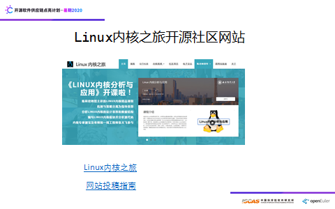

网站始建于2004年，重构于今年，是社区资源的承载输出子平台，提供了内核博客、Github、内核视频、社区项目、电子杂志、我的著作、原网站链接等资源的传送门，涵盖我的开源书籍、读者读书笔记、学校课堂内核教学完整录制视频（2000多分钟）等资源。内核学习者可以在这里找到你想要的资源，你还可以进行投稿，甚至可以优化我们的网站，详细参与方式在网站博客中可以找到。是不是有点推广的味道了，但的确，二十多年的积累，打算全部输出，也看到了后浪的担当，他们将站在开源的浪尖乘风破浪。

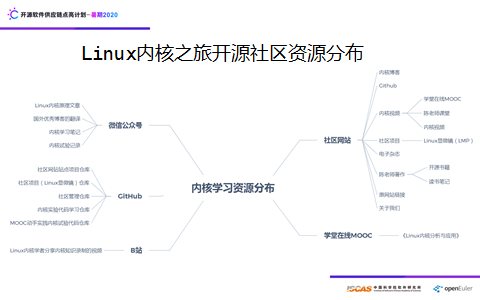

除了网站，现在的主战场在是公众号，从2015年开始推送文章，这5年多的坚持，积累了近上千篇文章，很多精彩文章值得一读再读，目前没有进行分类，希望读者中有人来做这件事，以利益更多的读者。

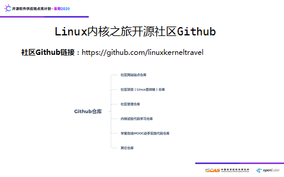

GitHub仓库就像自家的自留地，可随时参与，自由耕种，这其中也有很多好玩的东西了，后浪们在维护这里，希望你也到这里来。

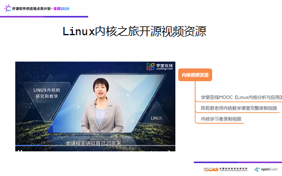

内核的学习资源很多，其中有一种选择就是看我们录制的《Linux内核分析与应用》，发布在学堂在线，每章的动手实践走一遍，可以说你基本入门了，而谢宝友老中医的工程实践做一遍，可以说你与一线工程就有了对接，而笨叔的《奔跑吧Linux内核入门篇》，使得你往内核的深处走就有了抓手。

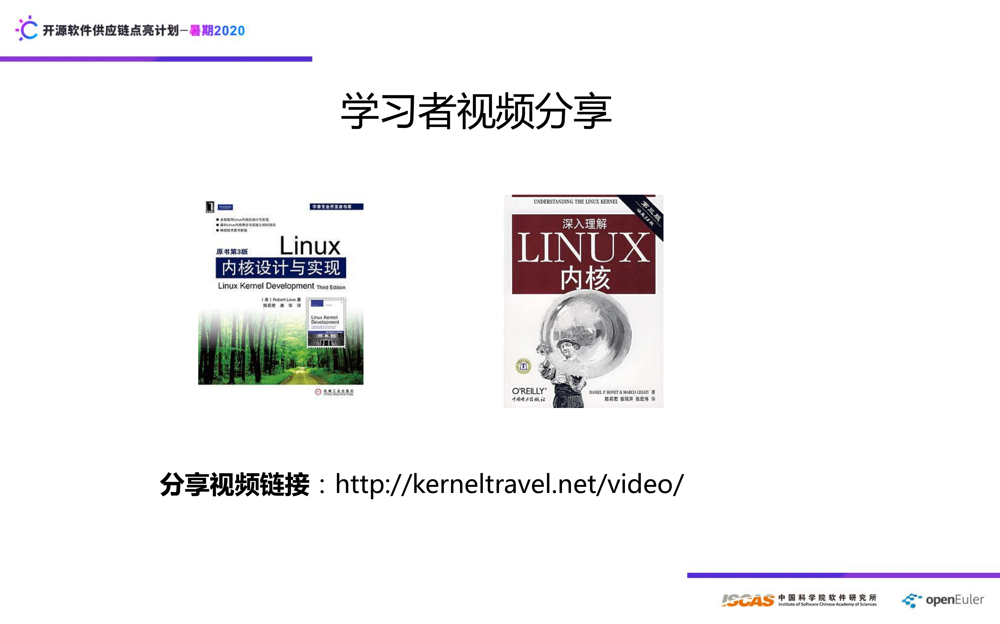

Linux内核有三本经典的书，其中有两本，每本三版是我翻译的，如果你想深入Linux内核，那么这些书是必读书，大部头，难啃，但生命的精彩不就是像钻头一样深入到无人之地，遇见未知的自己么。

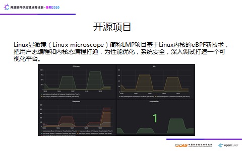

学Linux内核后能否参与到一个开源项目中，当然，目前的开源项目很多，这里后浪们整了一个开源项目比较有意思，他们起了一个有趣的名字叫Linux显微镜，顾名思义，我们有一种方法，可以像用显微镜观察微生物一样，观察计算机系统执行过程的每一个细微变化，而且，这件事可以在用户态进行，这是如何做到的？

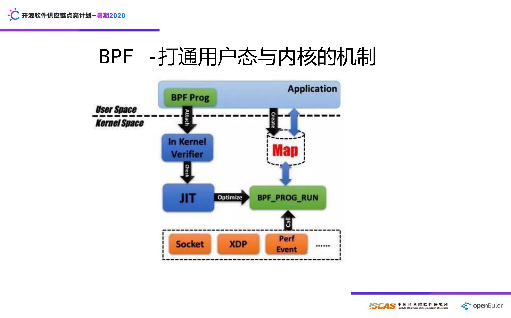

eBPF起源于Berkeley Packet Filter，是一个网络包过滤软件，但是在Linux新内核中对其做了很多扩展和优化。目前它可用于方方面面：性能优化，安全性，跟踪和设备驱动等等。从这个图可以看出，BPF把用户态的代码注入内核并进行验证，JIT相当于虚拟机，对其进行解释，map机制相当于桥梁，把内核的信息传递给用户态。

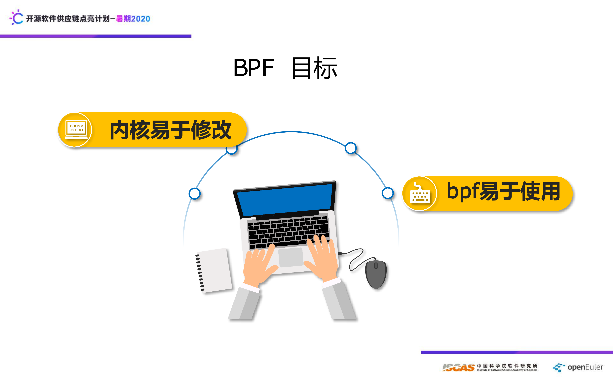

BPF的目标是什么呢，一是使得内核易于修改，二是bpf易于使用。

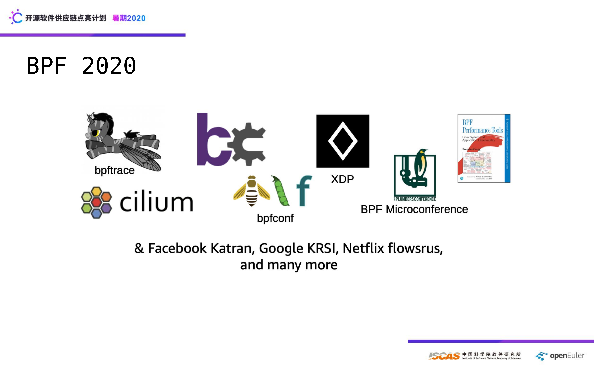

目前有哪些大厂都在用bpf，这里列出facebook,google,Netfix,Redhat， 优化大神Greeg更是写了一本书。

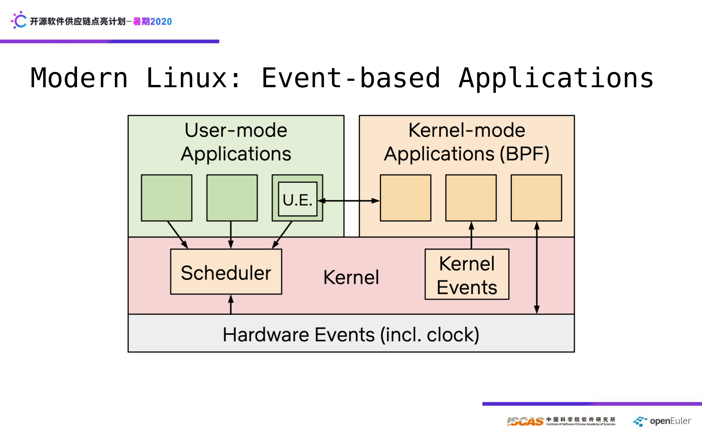

这张图是大神Greeg给出的，可以看到BPF逐渐占据半壁江山的趋势，而性能优化更可能发展为一门新的学科。

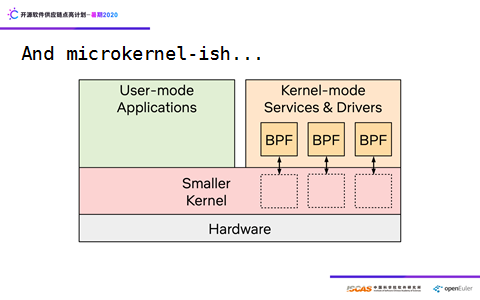

BPF也会改变Linux内核的单模块结构，使得Linux具有微内核的特征，这个有点不可思议，大家慢慢琢磨。

BPF的一种经典图，在用户态可以通过python,go,C语言写各种程序，以达成自己的目标，比如安全，细粒度观测、故障检测，驱动程序等等。

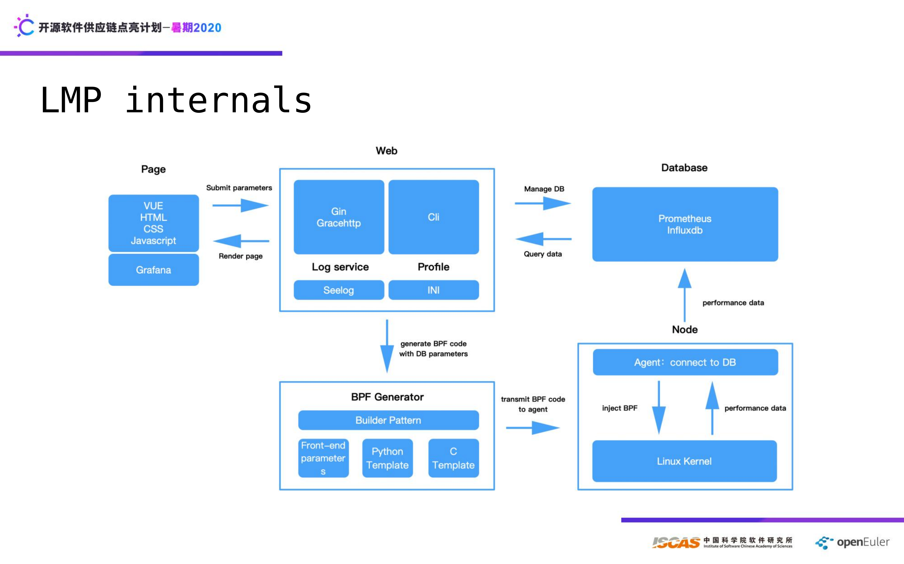

这是我们社区LMP项目架构图，目前LMP关注应用、系统性能数据的可观测性，基于BCC项目（BPF前端），实现云端应用、系统性能数据的提取和展示。目前LMP项目的性能数据提取中，涉及Linux内核各个子系统，例如：进程管理、文件系统等。该架构图包括web部分和BPF部分。在参与LMP项目的过程中，可以学习到Linux内核各个子系统中关键代码的执行原理，性能的背景知识，以及web开发，体验到使用BPF来学习Linux内核的乐趣。项目未来的目标：是彻底把用户态编程和内核态编程打通，为性能优化，系统安全，深入调试打造一个可视化平台。

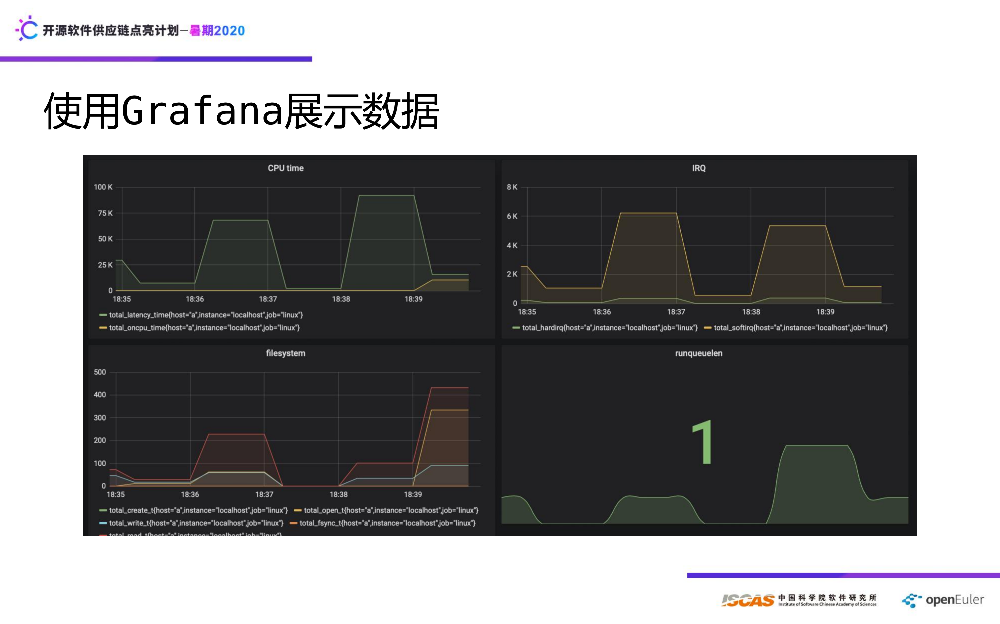

直播内容就分享到这里，更多精彩内容，请关注我们的微信公众号：Linux内核之旅，谢谢大家！