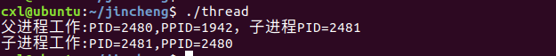
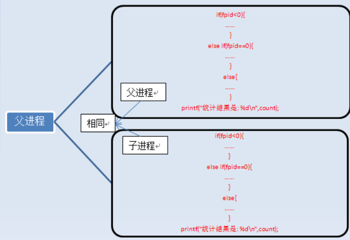
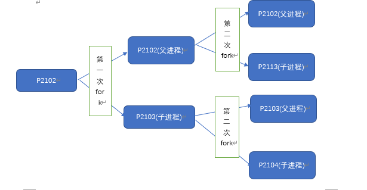

进程创建代码：

\#include<stdio.h>

\#include<sys/stat.h>

\#include<unistd.h>

 int main()

{    pid_t id=fork();

​    if(id<0)

​    {

​        printf("子进程创建失败\n");

​    }

​    else if(id==0)

​    {

​        printf("子进程工作:PID=%d,PPID=%d\n", getpid(), getppid());

​    

​    }

​    else

​    {

​        printf("父进程工作:PID=%d,PPID=%d，子进程PID=%d\n", getpid(), getppid(),id); 

​         sleep(5); 

​    }

 

​    return 0;

}

结果：

为何会先执行父进程，后执行子进程？

答：与当前的操作系统有关系

注：fork函数的使用说明

一个进程调用fork（）函数后，系统先给新的进程分配资源，例如存储数据和代码的空间。然后把原来的进程（fork）的所有值都复制到新的新进程中，只有少数值与原来的进程的值不同。

fork调用的一个奇妙之处就是它仅仅被调用一次，却能够返回两次，它可能有三种不同的返回值：

1）在父进程中，fork返回新创建子进程的进程ID；
   2）在子进程中，fork返回0；
   3）如果出现错误，fork返回一个负值；

在fork函数执行完毕后，如果创建新进程成功，则出现两个进程，一个是子进程，一个是父进程。在子进程中，fork函数返回0，在父进程中，fork返回新创建子进程的进程ID。我们可以通过fork返回的值来判断当前进程是子进程还是父进程。

可以通过getpid()获取子进程的pid 号，通过getppid()函数获得父进程的pid号。

Fork()进阶

 #include <unistd.h> 

#include <stdio.h> 

 **int** main(**void**) 

 { 

  **int** i=0; 

 printf("i son/pa ppid pid fpid/n"); 

  //ppid指当前进程的父进程pid 

  //pid指当前进程的pid, 

  //fpid指fork返回给当前进程的值 

 **for**(i=0;i<2;i++){ 

  pid_t fpid=fork(); 

 **if**(fpid==0) 

​     printf("%d child %4d %4d %4d/n",i,getppid(),getpid(),fpid); 

 **else** 

​    printf("%d father %4d %4d %4d/n",i,getppid(),getpid(),fpid); 

 } 

return** 0; } 

结果：

分析：

 这份代码比较有意思，我们来认真分析一下：

第一步：在父进程中，指令执行到for循环中，i=0，接着执行fork，fork执行完后，系统中出现两个进程，分别是p2102和p2103，p2102的父进程是p1961,p2103的父进程是p2102.

P1961->p2102->2103

第一次fork后，p2102（父进程)的变量为i=0,fpid=2103(子进程的pid)

  P2103(子进程)的变量为i=0,fpid=0(fork在子函数中返回0)

第二步：假设父进程p2102先执行，当进入下一个循环后，新增加了p2104,此时p2102->p2103->p2104;同理：在进程中，p2103->p2104->0

第三步：无法进入fork,直接返回

 

图解

 

 

总结一下规律，对于这种N次循环的情况，执行printf函数的次数为2*（1+2+4+……+2N-1）次，创建的子进程数为1+2+4+……+2N-1个。

大家如果想测一下一个程序中到底创建了几个子进程，最好的方法就是调用printf函数打印该进程的pid，也即调用printf("%d/n",getpid());或者通过printf("+/n");来判断产生了几个进程。

 

注：vfork与fork的主要区别：

fork要复制父进程的数据段，而vfork则不需要完全复制父进程的数据段，子进程与父进程共享数据段。Fork不对父进程的执行的次序进行任何限制；而在vfork调整中，子进程先先运行，父进程挂起。

 