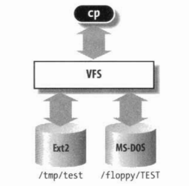

# 虚拟文件系统

虚拟文件系统所隐含的思想是把表示很多不同种类文件系统的共同信息放入内核；其中有一个字段或函数来支持Linux所支持的所有实际文件系统所提供的任何操作。对所调用的每个读、写或其他函数，内核都能把它们替换成支持本地Linux文件系统、NTFS文件系统，或者文件所在的任何其他文件系统的实际函数。

## 虚拟文件系统（VFS）的作用

虚拟文件系统(Virtual Filesystem)也可以称之为虚拟文件系统转换(Virtual Filesystem Switch,VFS)，是一个内核软件层，用来处理与Unix标准文件系统相关的所有系统调用。其健壮性表现在能为各种文件系统提供一个通用的接口。
VFS是用户的应用程序与文件系统实现之间的抽象层。因此，cp程序并不需要知道/floppy/TEST和/tmp/test是什么文件系统类型。相反.cp程序直接与VFS交互，这是通过普通系统调用来进行的。



## 通用文件模型

VFS所隐含的主要思想在于引入了一个通用的文件模型(common file model)，这个模型能够表示所有支持的文件系统。该模型严格反映传统Unix文件系统提供的文件模型。要实现每个具体的文件系统，必须将其物理组织结构转换为虚拟文件系统的通用文件模型。例如，在通用文件模型中，每个目录被看作一个文件，可以包含若干文件和其他的子目录。但是，存在几个非Unix的基于磁盘的文件系统，它们利用文件分配表(File AllocationTable，FAT)存放每个文件在目录树中的位置，在这些文件系统中，存放的是目录而不是文件。为了符合VFS的通用文件模型，对上述基于FAT的文件系统的实现，Linux必须在必要时能够快速建立对应于日录的文件。这样的文件只作为内核内存的对象而存在。

## 通用文件模型的组成：

### 超级块对象（superblock object)

存放已安装文件系统的有关信息。对基于磁盘的文件系统，这类对象通常对应于存放在磁盘上的文件系统控制块(filesystem control block)。

#### super_block的数据结构

```c
struct super_block {
	struct list_head	s_list;		/* 指向超级块链表的指针 */
	dev_t			s_dev;		/* 设备标识符 */
	unsigned char		s_dirt;//修改（脏）标志
	unsigned char		s_blocksize_bits;//以位为单位的块大小
	unsigned long		s_blocksize;//以字节为单位的块大小
	loff_t			s_maxbytes;	/* 文件的最长长度*/
	struct file_system_type	*s_type;//文件系统类型
	const struct super_operations	*s_op;//超级块方法
	const struct dquot_operations	*dq_op;//磁盘限额处理方法
	const struct quotactl_ops	*s_qcop;//磁盘限额管理方法
	const struct export_operations *s_export_op;//网络文件系统使用的输出操作
	unsigned long		s_flags;//安装标志
	unsigned long		s_magic;//文件系统的魔数
	struct dentry		*s_root;//文件系统根目录的目录项对象
	struct rw_semaphore	s_umount;//卸载所用的信号量
	struct mutex		s_lock;//超级块信号量
	int			s_count;//引用计数器
	atomic_t		s_active;//次级引用计数器
#ifdef CONFIG_SECURITY
	void                    *s_security;//指向超级块安全数据结构的指针
#endif
	const struct xattr_handler **s_xattr;//指向超级块扩展属性结构的指针

struct list_head	s_inodes;	/* 所有索引节点的链表 */
struct hlist_bl_head	s_anon;		/* 用于处理远程网络文件系统的匿名目录项的链表*/

#ifdef CONFIG_SMP
	struct list_head __percpu *s_files;
#else
	struct list_head	s_files;//文件对象的链表
#endif
	/* s_dentry_lru, s_nr_dentry_unused protected by dcache.c lru locks */
	struct list_head	s_dentry_lru;	/* unused dentry lru */
	int			s_nr_dentry_unused;	/* # of dentry on lru */

struct block_device	*s_bdev;//指向块设备驱动程序描述符的指针
struct backing_dev_info *s_bdi;
struct mtd_info		*s_mtd;
struct list_head	s_instances;//用于给定文件系统类型的超级快对象链表的指针
struct quota_info	s_dquot;	/* 磁盘限额的描述符 */

int			s_frozen;//冻结文件系统时使用的标志
wait_queue_head_t	s_wait_unfrozen;//进程挂起的等待队列，直到文件系统被解冻

char s_id[32];				/* 包含超级快的块设备名称 */
u8 s_uuid[16];				/* UUID */

void 			*s_fs_info;	/* 指向特定文件系统的超级块信息的

指针*/
	fmode_t			s_mode;

/* Granularity of c/m/atime in ns.
   Cannot be worse than a second */
u32		   s_time_gran;//时间戳的粒度（纳秒级）

/*

 * The next field is for VFS *only*. No filesystems have any business
 * even looking at it. You had been warned.
   */
   struct mutex s_vfs_rename_mutex;	/* Kludge */

/*

 * Filesystem subtype.  If non-empty the filesystem type field
 * in /proc/mounts will be "type.subtype"
   */
   char *s_subtype;

/*

 * Saved mount options for lazy filesystems using
 * generic_show_options()
   */
   char __rcu *s_options;
   const struct dentry_operations *s_d_op; /* default d_op for dentries */

};
```

所有超级块对象都以双向循环链表的形式链接在一起。链表中第一个元素用super_blocks变量来表示，而超级块对象的s_list字段存放指向链表相邻元素的指针。sb_lock自旋锁保护链表免受多处理器系统上的同时访问。s_fs_info字段指向属于具体文件系统的超级块信息。通常，为了效率起见，由s_fs_info字段所指向的数据被复制到内存。任何基于磁盘的文件系统都需要访问和更改自己的磁盘分配位图，以便分配或释放磁盘块。VFS允许这些文件系统直接对内存超级块的s_fs_info字段进行操作，而无需访问磁盘。但是，这种方法带来一个新问题：有可能VFS超级块最终不再与磁盘上相应的超级块同步。因此，有必要引入一个s_dirt标志来表示该超级块是否是脏的——那磁盘上的数据是否必须要更新。

#### 超级块操作：

```c
struct super_operations {
   	struct inode *(*alloc_inode)(struct super_block *sb);
    //为索引节点对象分配空间，包括具体文件系统的数据所需要的空间。
	void (*destroy_inode)(struct inode *);
	//撤消索引节点对象，包括具体文件系统的数据。
   	void (*dirty_inode) (struct inode *);
    //当索引节点标记为修改(脏)时调用。像ReiserFS和Ext3这样的文件系统用它来更新磁盘上的文件系统日志。
	int (*write_inode) (struct inode *, struct writeback_control *wbc);
    //用通过传递参数指定的索引节点对象的内容更新一个文件系统的索引节点。索引节点对象的i_ino字段标识所涉及磁盘上文件系统的索引节点。flag参数表示I/O操作是否应当同步。
	int (*drop_inode) (struct inode *);
    //在即将撤消索引节点时调用——也就是说，当最后一个用户释放该索引节点时，实现该方法的文件系统通常使用generic_drop_inode()函数。该函数从VFS数据结构中移走对索引节点的每一个引用，如果索引节点不再出现在任何目录中，则调用超级块方法delete_inode将它从文件系统中删除。
	void (*evict_inode) (struct inode *);
	void (*put_super) (struct super_block *);
    //释放通过传递的参数指定的超级块对象(因为相应的文件系统被卸载)。
	void (*write_super) (struct super_block *);
    //用指定对象的内容更新文件系统的超级块。
	int (*sync_fs)(struct super_block *sb, int wait);
    //在清除文件系统来更新磁盘上的具体文件系统数据结构时调用(由日志文件系统使用)。
	int (*freeze_fs) (struct super_block *);
	int (*unfreeze_fs) (struct super_block *);
	int (*statfs) (struct dentry *, struct kstatfs *);
    //将文件系统的统计信息返回，填写在buf缓冲区中。
	int (*remount_fs) (struct super_block *, int *, char *);
    //用新的选项重新安装文件系统(当某个安装选项必须被修改时被调用)。
	void (*umount_begin) (struct super_block *);
    //中断一个安装操作，因为相应的卸载操作已经开始(只在网络文件系统中使用)。

int (*show_options)(struct seq_file *, struct vfsmount *);
    //用来显示特定文件系统的选项。
int (*show_devname)(struct seq_file *, struct vfsmount *);
int (*show_path)(struct seq_file *, struct vfsmount *);
int (*show_stats)(struct seq_file *, struct vfsmount *);

#ifdef CONFIG_QUOTA
	ssize_t (*quota_read)(struct super_block *, int, char *, size_t, loff_t);
    //限额系统使用该方法从文件中读取数据
	ssize_t (*quota_write)(struct super_block *, int, const char *, size_t, loff_t);
    //限额系统使用该方法将数据写入文件中。
#endif
	int (*bdev_try_to_free_page)(struct super_block*, struct page*, gfp_t);
};
```

前述的方法对所有可能的文件系统类型均是可用的。但是，只有其中的一个子集应用到每个具体的文件系统；未实现的方法对应的字段置为NULL

### 索引节点对象(inode object)

存放关于具体文件的一般信息。对基于磁盘的文件系统，这类对象通常对应于存放在磁盘上的文件控制块(file control block)。每个索引节点对象都有一个索引节点号，这个节点号唯一地标识文件系统中的文件。

```c
struct inode {
	/* RCU path lookup touches following: */
	umode_t			i_mode;//文件类型与访问权限
	uid_t			i_uid;//所有者标识符
	gid_t			i_gid;//组标识符
	const struct inode_operations	*i_op;//索引节点的操作
	struct super_block	*i_sb;//指向超级块对象的指针

spinlock_t		i_lock;	/* 保护索引节点一些字段的自旋锁  */
unsigned int		i_flags;//文件系统的安装标志
struct mutex		i_mutex;

unsigned long		i_state;//索引节点的状态标志
unsigned long		dirtied_when;	/* 索引节点的弄脏时间(以节拍为
单位) */

struct hlist_node	i_hash;//用于散列链表的指针
struct list_head	i_wb_list;	/* backing dev IO list */
struct list_head	i_lru;		/* inode LRU list */
struct list_head	i_sb_list;//用于超级块的索引节点链表的指针
union {
	struct list_head	i_dentry;//引用索引节点的目录项对象链表的头
	struct rcu_head		i_rcu;
};
unsigned long		i_ino;//索引节点号
atomic_t		i_count;//引用计数器
unsigned int		i_nlink;//硬连接数目
dev_t			i_rdev;//实设备标识符
unsigned int		i_blkbits;////块的位数
u64			i_version;//版本号
loff_t			i_size;//文件的字节数

#ifdef __NEED_I_SIZE_ORDERED
	seqcount_t		i_size_seqcount;//SMP系统为i_size字段获取一致值时使用的顺序计数器
#endif
	struct timespec		i_atime;//上次访问文件的时间
	struct timespec		i_mtime;//上次写文件的时间
	struct timespec		i_ctime;//上次修改索引节点的时间
	blkcnt_t		i_blocks;////文件的块数
	unsigned short          i_bytes;//文件中最后一个块的字节数
	struct rw_semaphore	i_alloc_sem;//在直接I/O文件操作中避免出现竞争条件的读写信号量
	const struct file_operations	*i_fop;	/* 缺省文件操作 */
	struct file_lock	*i_flock;//指向文件锁链表的指针
	struct address_space	*i_mapping;//指向address_space对象的指针
	struct address_space	i_data;//文件的address_space对象
#ifdef CONFIG_QUOTA
	struct dquot		*i_dquot[MAXQUOTAS];//索引节点磁盘限额
#endif
	struct list_head	i_devices;//用于具体的字符或块设备索引节点链表的指针
	union {
		struct pipe_inode_info	*i_pipe;//如果文件是一个管道则使用它
		struct block_device	*i_bdev;//指向块设备驱动程序的指针
		struct cdev		*i_cdev;//指向字符设备驱动程序的指针
	};

__u32			i_generation;//索引节点版本号

#ifdef CONFIG_FSNOTIFY
	__u32			i_fsnotify_mask; /* all events this inode cares about */
	struct hlist_head	i_fsnotify_marks;
#endif

#ifdef CONFIG_IMA
	atomic_t		i_readcount; /* struct files open RO */
#endif
	atomic_t		i_writecount;//用于写进程的引用计数器
#ifdef CONFIG_SECURITY
	void			*i_security;//指向索引节点安全结构的指针
#endif
#ifdef CONFIG_FS_POSIX_ACL
	struct posix_acl	*i_acl;
	struct posix_acl	*i_default_acl;
#endif
	void			*i_private; /* fs or device private pointer */
};
```

每个索引节点对象都会复制磁盘索引节点包含的一些数据，比如分配给文件的磁盘块数。如果i_state字段的值等于I_DIRTY_SYNC、I_DIRTY_DATASYNC或I_DIRTY_PAGES，该索引节点就是“脏“的，也就是说，对应的磁盘索引节点必须被更新。I_DIRTY宏可以用来立即检查这三个标志的值(详细内容参见后面)。i_state字段的其他值有I_LOCK（涉及的索引节点对象处于I/O传送中）、I_FREEING（索引节点对象正在被释放)、I_CLEAR（索引节点对象的内容不再有意义）以及I_NEW（索引节点对象已经分配但还没有用从磁盘索引节点读取来的数据填充)。每个索引节点对象总是出现在下列双向循环链表的某个链表中(所有情况下，指向相邻元素的指针存放在i_list字段中）：

- 有效未使用的索引节点链表，典型的如那些镜像有效的磁盘索引节点，且当前未被任何进程使用。这些索引节点不为脏，且它们的i_count字段置为0。链表中的首元素和尾元素是由变量inode_unused的next字段和prev字段分别指向的。这个链表用作磁盘高速缓存。
- 正在使用的索引节点链表，也就是那些镜像有效的磁盘索引节点，且当前被某些进程使用。这些索引节点不为脏，但它们的i_count字段为正数。链表中的首元素和尾元素是由变量inode_in_use引用的。
- 脏索引节点的链表。链表中的首元素和尾元素是由相应超级块对象的s_dirty字段引用的。

这些链表都是通过适当的索引节点对象的i_list字段链接在一起的。此外，每个索引节点对象也包含在每文件系统（per-filesystem）的双向循环链表中，链表的头存放在超级块对象的s_inodes字段中；索引节点对象的i_sb_list字段存放了指向链表相邻元素的指针。

#### 索引节点操作：

```c
struct inode_operations {
	struct dentry * (*lookup) (struct inode *,struct dentry *, struct nameidata *);
    //为包含在一个目录项对象中的文件名对应的索引节点查找目录。
	void * (*follow_link) (struct dentry *, struct nameidata *);
    //解析索引节点对象所指定的符号链接；如果该符号链接是一个相对路径名，则从第二个参数所指定的目录开始进行查找。
	int (*permission) (struct inode *, int, unsigned int);
    //检查是否允许对与索引节点所指的文件进行指定模式的访问。
	int (*check_acl)(struct inode *, int, unsigned int);

int (*readlink) (struct dentry *, char __user *,int);
    //将目录项所指定的符号链接中对应的文件路径名拷贝到buffer所指定的用户态内存区。
void (*put_link) (struct dentry *, struct nameidata *, void *);
//释放由follow_link方法分配的用于解析符号链接的所有临时数据结构。
int (*create) (struct inode *,struct dentry *,int, struct nameidata *);
    //在某一目录下，为与目录项对象相关的普通文件创建一个新的磁盘索引节点。
int (*link) (struct dentry *,struct inode *,struct dentry *);
    //创建一个新的名为new_dentry的硬链接，它指向dir目录下名为old_dentry的文件。
int (*unlink) (struct inode *,struct dentry *);
    //从一个目录中删除目录项对象所指定文件的硬链接。
int (*symlink) (struct inode *,struct dentry *,const char *);
    //在某个目录下，为与目录项对象相关的符号链接创建一个新的索引节点。
int (*mkdir) (struct inode *,struct dentry *,int);
    //在某个目录下，为与目录项对象相关的目录创建一个新的索引节点。
int (*rmdir) (struct inode *,struct dentry *);
    //从一个目录删除子目录，子目录的名称包含在目录项对象中。
int (*mknod) (struct inode *,struct dentry *,int,dev_t);
    //在某个目录中，为与目录项对象相关的特定文件创建一个新的磁盘索引节点。其中参数mode和rdev分别表示文件的类型和设备的主次设备号。
int (*rename) (struct inode *, struct dentry *,
		struct inode *, struct dentry *);
    //将old_dir目录下由old_entry标识的文件移到new_dir目录下。新文件名包含在new_dentry指向的目录项对象中。
void (*truncate) (struct inode *);
    //修改与索引节点相关的文件长度。在调用该方法之前,必须将inode对象的i_size字段设置为需要的新长度值。
int (*setattr) (struct dentry *, struct iattr *);
    //在触及索引节点属性后通知一个“修改事件
int (*getattr) (struct vfsmount *mnt, struct dentry *, struct kstat *);
    //由一些文件系统用于读取索引节点属性。
int (*setxattr) (struct dentry *, const char *,const void *,size_t,int);
    //为索引节点设置“扩展属性“(扩展属性存放在任何索引节点之外的磁盘块中)。
ssize_t (*getxattr) (struct dentry *, const char *, void *, size_t);
    //获取索引节点的扩展属性。
ssize_t (*listxattr) (struct dentry *, char *, size_t);
    //获取扩展属性名称的整个链表。
int (*removexattr) (struct dentry *, const char *);
    //删除索引节点的扩展属性。
void (*truncate_range)(struct inode *, loff_t, loff_t);
int (*fiemap)(struct inode *, struct fiemap_extent_info *, u64 start,
	      u64 len);
}
```

上述列举的方法对所有可能的索引节点和文件系统类型都是可用的。不过，只有其中的一个子集应用到某一特定的索引节点和文件系统；未实现的方法对应的字段被置为NULL。

### 文件对象(file object)

存放打开文件与进程之间进行交互的有关信息。这类信息仅当进程访问文件期间存在于内核内存中。

```c
struct file {
	/*
	 * fu_list becomes invalid after file_free is called and queued via
	 * fu_rcuhead for RCU freeing
	 */
	union {
		struct list_head	fu_list;
		struct rcu_head 	fu_rcuhead;
	} f_u;
	struct path		f_path;
#define f_dentry	f_path.dentry//与文件相关的目录项对象
#define f_vfsmnt	f_path.mnt//含有该文件的已安装文件系统
	const struct file_operations	*f_op;//指向文件操作表的指针
	spinlock_t		f_lock;  /* f_ep_links, f_flags, no IRQ */
#ifdef CONFIG_SMP
	int			f_sb_list_cpu;
#endif
	atomic_long_t		f_count;//文件的引用计数（有多少进程打开该文件） 
	unsigned int 		f_flags;//当打开文件时所指定的标志 
	fmode_t			f_mode;//读写模式：open的mod_t mode参数 
	loff_t			f_pos;//该文件在当前进程中的文件偏移量 
	struct fown_struct	f_owner;//该结构的作用是通过信号进行I/O事件通知的数据 
	const struct cred	*f_cred;
	struct file_ra_state	f_ra;//文件预读状态

u64			f_version;//版本号，每次使用后自动递增

#ifdef CONFIG_SECURITY
	void			*f_security;//指向文件对象的安全结构的指针
#endif
	/* needed for tty driver, and maybe others */
	void			*private_data;//该成员是系统调用时保存状态信息非常有用的资源。

#ifdef CONFIG_EPOLL
	/* Used by fs/eventpoll.c to link all the hooks to this file */
	struct list_head	f_ep_links;//文件的事件轮询等待者链表的头
#endif /* #ifdef CONFIG_EPOLL */
	struct address_space	*f_mapping;//指向文件地址空间对象的指针
#ifdef CONFIG_DEBUG_WRITECOUNT
	unsigned long f_mnt_write_state;
#endif
};
```

存放在文件对象中的主要信息是文件指针，即文件中当前的位置，下一个操作将在该位置发生。由于几个进程可能同时访问同一文件，因此文件指针不许存放在文件对象而不是索引节点对象中。文件对象通过一个名为filp的slab高速缓存分配，filp描述符地址存放在filp_cachep变量中。由于分配的文件对象数目是有限的，因此files_stat变量在其max_files字段中指定了可分配文件对象的最大数目，也就是系统可同时访问的最大文件数。
在使用文件对象包含在由具体文件系统的超级块所确立的几个链表中。每个超级块对象把文件对象链表的头存放在s_files字段中，因此，属于不同文件系统的文件对象就包含在不同的链表中。链表中分别指向前一个元素和后一个元素的指针都存放在文件对象的f_list字段中。files_lock自旋锁保护超级块的s_files链表免受多处理器系统上的同时访问。
文件对象的f_count字段是一个引用计数器：它记录使用文件对象的进程数。当内核本身使用该文件对象时也要增加计数器的值——例如，把对象插入链表中或发出dup()系统调用时。

#### 文件对象操作

```c
struct file_operations {
	struct module *owner;
	loff_t (*llseek) (struct file *, loff_t, int);
    //更新文件指针。
	ssize_t (*read) (struct file *, char __user *, size_t, loff_t *);
    //从文件的+offset处开始读出count个字节；然后增加*offset的值(一般与文件指针对应)。
	ssize_t (*write) (struct file *, const char __user *, size_t, loff_t *);
    //从文件的*offset处开始写入count个字节，然后增加*offset的值(一般与文件指针对应)。
	ssize_t (*aio_read) (struct kiocb *, const struct iovec *, unsigned long, loff_t);
    //启动一个异步I/O操作，从文件的pos处开始读出1en个字节的数据并将它们放入buf中(引入它是为了支持io_submit()系统调用)。
	ssize_t (*aio_write) (struct kiocb *, const struct iovec *, unsigned long, loff_t);
    //启动一个异步I/O操作，从buf中取1en个字节写入文件pos处。
	int (*readdir) (struct file *, void *, filldir_t);
    //返回一个目录的下一个目录项，返回值存入参数dirent；参数fi11dir存放一个辅助函数的地址，该函数可以提取目录项的各个字段。
	unsigned int (*poll) (struct file *, struct poll_table_struct *);
    //检查是否在一个文件上有操作发生，如果没有则睡眠，直到该文件上有操作发生。
	long (*unlocked_ioctl) (struct file *, unsigned int, unsigned long);
    //与ioct1方法类似，但是它不用获得大内核锁。我们认为所有的设备驱动程序和文件系统都将使用这个新方法而不是ioctl方法。
	long (*compat_ioctl) (struct file *, unsigned int, unsigned long);
    //64位的内核使用方法执行32位的系统调用ioct1()。
	int (*mmap) (struct file *, struct vm_area_struct *);
    //执行文件的内存映射，并将映射放入进程的地址空间
	int (*open) (struct inode *, struct file *);
    //通过创建一个新的文件对象而打开一个文件，并把它链接到相应的索引节点对象
	int (*flush) (struct file *, fl_owner_t id);
    //当打开文件的引用被关闭时调用该方法。该方法的实际用途取决于文件系统。
	int (*release) (struct inode *, struct file *);
    //释放文件对象。当打开文件的最后一个引用被关闭时(即文件对象f_count字段的值变为0时)调用该方法。
	int (*fsync) (struct file *, int datasync);
    //将文件所缓存的全部数据写入磁盘。
	int (*aio_fsync) (struct kiocb *, int datasync);
    //启动一次异步I/O刷新操作。
	int (*fasync) (int, struct file *, int);
    //通过信号来启用或禁止1/O事件通告。
	int (*lock) (struct file *, int, struct file_lock *);
    //对file文件申请一个锁(参见本章后面的“文件加锁“一节)。
	ssize_t (*sendpage) (struct file *, struct page *, int, size_t, loff_t *, int);
	unsigned long (*get_unmapped_area)(struct file *, unsigned long, unsigned long, unsigned long, unsigned long);
    //获得一个未用的地址范围来映射文件。
	int (*check_flags)(int);
    //当设置文件的状态标志(F_SETFL命令)时，fcnt1()系统调用的服务例程调用该方法执行附加的检查。当前只适用于NFS网络文件系统。
	int (*flock) (struct file *, int, struct file_lock *);
    //用于定制flock()系统调用的行为。官方Linux文件系统不使用该方法。
	ssize_t (*splice_write)(struct pipe_inode_info *, struct file *, loff_t *, size_t, unsigned int);
	ssize_t (*splice_read)(struct file *, loff_t *, struct pipe_inode_info *, size_t, unsigned int);
	int (*setlease)(struct file *, long, struct file_lock **);
	long (*fallocate)(struct file *file, int mode, loff_t offset,
			  loff_t len);
};
```

以上描述的方法对所有可能的文件类型都是可用的。不过，对于一个具体的文件类型，只使用其中的一个子集，那些未实现的方法对应的字段被置为NULL。

### 目录项对象(dentry object)

存放目录项(也就是文件的特定名称)与对应文件进行链接的有关信息。每个磁盘文件系统都以自己特有的方式将该类信息存在磁盘上。

```c
struct dentry {
	/* RCU lookup touched fields */
	unsigned int d_flags;		/*目录项高速缓存标志 */
	seqcount_t d_seq;		/* per dentry seqlock */
	struct hlist_bl_node d_hash;	/* 指向散列表表项链表的指针 */
	struct dentry *d_parent;	/* 父目录的目录项对象 */
	struct qstr d_name;//文件名
	struct inode *d_inode;		/* 与文件名关联的索引节点 */
	unsigned char d_iname[DNAME_INLINE_LEN];	/* 存放短文件名的空间  */

/* Ref lookup also touches following */
unsigned int d_count;		/* protected by d_lock */
spinlock_t d_lock;		/* 保护目录项对象的自旋锁 */
const struct dentry_operations *d_op;//目录项方法
struct super_block *d_sb;	/* 文件的超级块对象 */
unsigned long d_time;		/*  由d_revalidate方法使用*/
void *d_fsdata;			/*  依赖于文件系统的数据*/

struct list_head d_lru;		/*用于未使用目录项链表的指针*/
/*

 * d_child and d_rcu can share memory
   */
   union {
   struct list_head d_child;	/*对目录而言，用于同一父目录中的目录项链表的指针 */
    	struct rcu_head d_rcu;//回收目录项对象时，由RCU描述符使用
   } d_u;
   struct list_head d_subdirs;	/* 对目录而言，用于同一索引节点相关的目录项链表的指针 */
   struct list_head d_alias;	/* 用于与同一索引节点（别名）相关的目录项链表的指针 */

};
```

#### 每个目录项对象可以处于以下四种状态之一：

空闲状态（free)
处于该状态的目录项对象不包括有效的信息，且还没有被VFS使用。对应的内存区由slab分配器进行处理。
未使用状态（unused）
处于该状态的目录项对象当前还没有被内核使用。该对象的引用计数器d_count的值为0，但其d_inode字段仍然指向关联的索引节点。该目录项对象包含有效的信息，但为了在必要时回收内存，它的内容可能被丢弃。
正在使用状态（in use)
处于该状态的目录项对象当前正在被内核使用。该对象的引用计数器d_count的值为正数，其d_inode字段指向关联的索引节点对象。该目录项对象包含有效的信息，并且不能被丢弃。
负状态（negative)
与目录项关联的索引节点不复存在，那是因为相应的磁盘索引节点已被删除，或者因为目录项对象是通过解析一个不存在文件的路径名创建的。目录项对象的d_inode字段被置为NULL，但该对象仍然被保存在目录项高速缓存中，以便后续对同一文件目录名的查找操作能够快速完成。术语“负状态“容易使人误解，因为根本不涉及任何负值。

#### 目录项操作：

```c
struct dentry_operations {
	int (*d_revalidate)(struct dentry *, struct nameidata *);
    //在把日录项对象转换为一个文件路径名之前，判定该目录项对象是否仍然有效。缺省的VFS函数什么也不做，而网络文件系统可以指定自己的函数。
	int (*d_hash)(const struct dentry *, const struct inode *,
			struct qstr *);
    //生成一个散列值；这是用于目录项散列表的，特定于具体文件系统的散列函数。参数dentry标识包含路径分量的目录。参数name指向一个结构，该结构包含要查找的路径名分量以及由散列函数生成的散列值。
	int (*d_compare)(const struct dentry *, const struct inode *,
			const struct dentry *, const struct inode *,
			unsigned int, const char *, const struct qstr *);
    //比较两个文件名。namel应该属于dir所指的目录。缺省的VFS 函数是常用的字符串匹配函数。不过，每个文件系统可用自己的方式实现这一方法。例如，MS-DOS文件系统不区分大写和小写字母。
	int (*d_delete)(const struct dentry *);
    //当对目录项对象的最后一个引用被删除（d_count变为“Q“)时，调用该方法。缺省的VFS函数什么也不做。
	void (*d_release)(struct dentry *);
    //当要释放一个日录项对象时（放入slab分配器)、调用该方法。缺省的VFS 函数什么也不做。
	void (*d_iput)(struct dentry *, struct inode *);
    //当一个日录项对象变为“负“状态（即丢弃它的索引节点)时，调用该方法。缺省的VFS 函数调用iput()释放索引节点对象。
	char *(*d_dname)(struct dentry *, char *, int);
	struct vfsmount *(*d_automount)(struct path *);
	int (*d_manage)(struct dentry *, bool);
}
```

