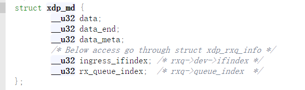
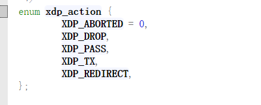
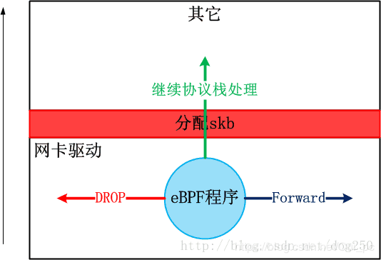

**网络钩子（hook）**

在计算机网络中，Hook钩子在操作系统中用于在调用前或执行过程中拦截网络数据包。Linux内核中暴露了多个钩子，BPF程序可以连接到这些钩子上，实现数据收集和自定义事件处理。虽然Linux内核中的钩子点很多，但我们将重点关注网络子系统中存在的两个钩子：XDP和TC。它们结合在一起，可以用来处理RX和TX上两个链路上靠近NIC的数据包，从而实现了许多网络应用的开发。今天我们先来讲讲XDP。

**eBPF**

eBPF（extended Berkeley Packet Filter）起源于BPF，它提供了内核的数据包过滤机制。

BPF is a highly flexible and efficient virtual machine-like construct in the Linux kernel allowing to execute bytecode at various hook points in a safe manner. It is used in a number of Linux kernel subsystems, most prominently networking, tracing and security (e.g. sandboxing).
BPF的最原始版本为cBPF，曾用于tcpdump
Berkeley Packet Filter 尽管名字的也表明最初是设计用于packet filtering，但是现在已经远不止networking上面的用途了.

XDP全称为**eXpress Data Path**，是Linux内核网络栈的最底层。它只存在于RX路径上，允许在网络设备驱动内部网络堆栈中数据来源最早的地方进行数据包处理，在特定模式下可以在操作系统分配内存（skb）之前就已经完成处理。

XDP暴露了一个可以加载BPF程序的网络钩子。在这个钩子中，程序能够对传入的数据包进行任意修改和快速决策，避免了内核内部处理带来的额外开销。这使得XDP在性能速度方面成为最佳钩子，例如缓解DDoS攻击等

**相对于DPDK，XDP具有以下优点：**

无需第三方代码库和许可
同时支持轮询式和中断式网络
无需分配大页
无需专用的CPU
无需定义新的安全网络模型

**XDP的使用场景包括：**

DDoS防御

防火墙

基于XDP_TX的负载均衡

网络统计

复杂网络采样

高速交易平台

**XDP输入参数**

XDP暴露的钩子具有特定的输入上下文，它是单一输入参数。它的类型为 struct xdp_md，在内核头文件bpf.h 中定义，具体字段如下所示：

程序执行时，data和data_end字段分别是数据包开始和结束的指针，它们是用来获取和解析传来的数据，第三个值是data_meta指针，初始阶段它是一个空闲的内存地址，供XDP程序与其他层交换数据包元数据时使用。最后两个字段分别是接收数据包的接口和对应的RX队列的索引。当访问这两个值时，BPF代码会在内核内部重写，以访问实际持有这些值的内核结构struct xdp_rxq_info。

**XDP输出参数**

在处理完一个数据包后，XDP程序会返回一个动作（Action）作为输出，它代表了程序退出后对数据包应该做什么样的最终裁决，也是在内核头文件bpf.h 定义了以下5种动作类型：

可以看出这个动作的本质是一个int值。前面4个动作是不需要参数的，最后一个动作需要额外指定一个NIC网络设备名称，作为转发这个数据包的目的地。

**XDP的位置**

最显而易见的是，竟然可以在如此低的层面上把数据包丢弃或者回弹回去，如果面临DDoS攻击，采用这种方式的话，数据包就没有必要上升到Netfilter层面再被丢弃了。说白了，XDP允许数据包在进入Linux协议栈之前就能受到判决。这相当于在网卡驱动层面运行了一个eBPF程序，该程序决定数据包何去何从。

而且，假设我们经过目标网络设备的Ingress流量被我们的XDP程序drop了，专业术语叫RX流向。那么Egress流量是否也会被drop掉呢？
答案是，不会。XDP hook不会作用到Egress流量，也就是TX流向。

