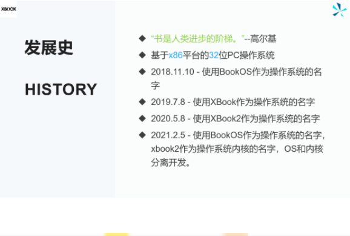
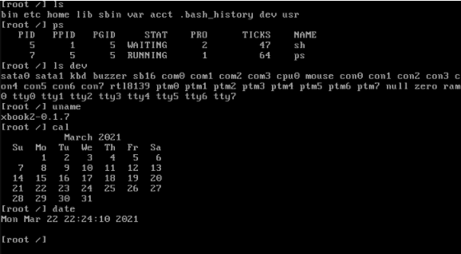
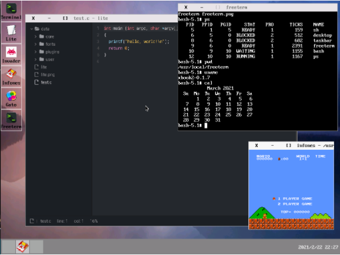
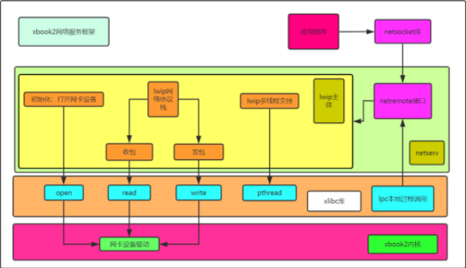
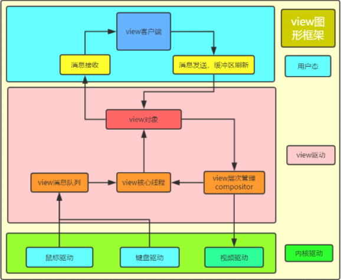

在上次的直播里，我们介绍BookOS的来源与其发展，并分析了其内核xbook2的框架，以及网络服务框架和图形框架。直播也收到很多观众的关注与喜欢，今天我们来总结一下上次的直播内容！
 1. BookOS的来源与发展
 2. BookOS的环境构建以及演示
 3. BookOS的网络服务框架
 4. BookOS的图形框架

## 1、BookOS的来源与发展

该部分介绍了BookOS的名字来源，来自高尔基名言：“书是人类进步的阶梯”。并且讲了发展史，BookOS也算是有历史的OS了，虽然很短暂。

## 2、 BookOS的环境构建以及演示

该环节演示了如何搭建开发环境，以及编译源码，并对BookOS和xbook2进行虚拟机演示和物理机演示。

xbook2内核演示

BookOS演示

## 3、BookOS的网络服务框架

在这部分主要介绍了BookOS的网络服务框架，融入了微内核的思想，基于lwip协议栈和lpc机制来实现，是一个位于用户态的服务程序。这种模式既有优点，又有缺点，只能算是一种大胆的尝试。

## 4、BookOS的图形框架

在这一部分，讲解了BookOS的图形框架，view图形驱动，是位于内核态的驱动程序，这个驱动又基于鼠标、键盘、视频驱动，相当于一个抽象的驱动。uveiw图形库，就是对这个驱动接口的简单封装。在此基础上，有一个xtk图形库，类似于gtk图形库，在此基础上构建起了BookOS的图形界面。

并且还和xwindow以及wayland进行了比较分析，来证明这个框架的可行性。

## 总结

BookOS的介绍直播只是简单地说了一下整体框架，让大家对内核的框架以及当前实现的功能有所了解。直播的最后也推荐了一些学习操作系统开发的书籍和资料，相信对想自己开发操作系统的同学一定会有所帮助！

[点击下载ppt](BookOS.pdf)
