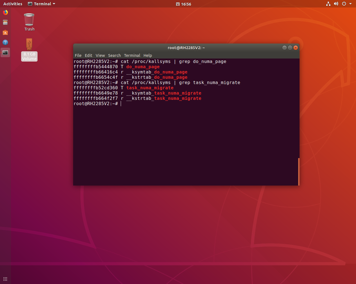

记录内核编译的过程，方便大家以后参考。

**Ubuntu18.04编译内核5.4.0**

论文实验需要编写BPF程序监控几个内核函数，但是要监控的内核函数都不在内核符号表里面。而BPF机制需要借助底层的Kprobe机制，kprobe对内核函数的跟踪又依赖于内核符号表，所以这几个不在内核符号表里的内核函数就无法使用BPF程序进行探测。所以修改了内核源码，把要跟踪的内核函数用EXPORT_SYMBOL_GPL宏导出到符号表，在重新编译内核后就可以在内核符号表kallsyms里找到函数的地址，这样就可以利用BPF程序进行hook。下面是重新编译内核后，导出了原来符号表里没有的两个内核函数。




## 服务器上使用Ubuntu18.04编译内核5.4.0

编译环境是RH2285V2服务器，系统是Ubuntu 18.04。在物理机上编译内核可能遇到很多的问题，出错了也不能像VMware虚拟机一样恢复快照，所以某个环节出错就可能导致无法正常进入系统。

> 注1：编译前一定要检查剩余可用的磁盘空间，可用最低不能低于20G。 注2：如果之前安装Ubuntu的时候，没有采用默认的磁盘分区，而是对不同的分区划分了不同的大小。那么请检查根目录/的可用空间。如果根分区/只剩余几百兆，接下来要么提前删除旧内核的启动镜像以腾出空间，要么直接选择别的系统进行编译。因为根分区空间不足的情况下，在安装内核的时候会提示root空间不足，如果强制ignore有可能导致不能正常进入系统及损坏系统。而且即使可以再次扩展根分区也很容易损坏/boot分区。

内核的编译过程大概分为以下几步：

1. 下载内核源码
2. 安装依赖的工具
3. 生成配置文件.config
4. 编译内核
5. 安装内核模块
6. 安装内核
7. 修改grub启动配置文件
8. 更新配置文件
9. 重启选择新内核

## 一、下载内核源码

[内核源码镜像站点](http://ftp.sjtu.edu.cn/sites/ftp.kernel.org/pub/linux/kernel/)


源码下载好后，可以在home目录新建一个文件夹，将源码包解压到这里。


## 二、安装依赖的工具

```
sudo apt install libncurses5-dev openssl libssl-dev build-essential pkg-config 
libc6-dev bison flex libelf-dev zlibc minizip libidn11-dev libidn11
```

## 三、生成配置文件.config

进入源码根目录，在根目录下执行make menuconfig，出现图形化配置界面。采用默认的内核配置，然后双击ESC退出。


在目录下查看，生成.config文件。


> 有些文章中会将/boot/里当前版本的.config文件复制一份，这种做法需要编辑.config文件然后注释掉CONFIG_SYSTEM_TRUSTED_KEYS，否则在编译过程中会编译中断。使用内核默认配置重新生成的.config文件进行编译则不会出现这个问题。

下面编译内核，以下操作都以root权限执行。

> 编译内核的操作会比较耗时，所以尽可能的开启多个逻辑核同时编译，可以减少编译时间。如果不清楚本机的CPU有多少个逻辑核，可以用lscpu查看逻辑核心数：


## 四、编译内核

在源码根目录执行make。为了加速编译，使用-j选项同时使用多个逻辑核进行编译，-j选项后面跟CPU支持的逻辑核数，可以节省编译的时间。

```
root@RH2285V2:/home/server/backup/linux-5.4# make -j16
```


查看编译后的内核大小，有19G。


## 五、安装内核模块

```
root@RH2285V2:/home/server/backup/linux-5.4# make modules_install
```

## 六、安装内核

```
root@RH2285V2:/home/server/backup/linux-5.4# make install
```

> 注3：使用make install方式安装内核，就不需要再使用mkinitramfs制作initrd.img文件  了，也不需要再用update-initramfs来更新。这些操作都会由make install自动完成，不需要再手动进行。

安装完内核之后，再手动更新一下grub。

```
root@RH2285V2:/home/server/backup/linux-5.4# update-grub
```

## 七、修改grub启动配置文件

vim编辑/etc/default/grub文件，改动三处：

将 "GRUB_TIMEOUT_STYLE=hidden" 注释掉（在前面加上“#”）。

将 "GRUB_TIMEOUT" 的值改为“15”。

将 "GRUB_CMDLINE_LINUX_DEFAULT" 的值改为“text”。


然后保存。

## 八、更新配置文件

```
root@RH2285V2:/home/server/backup/linux-5.4# update-grub
```

## 九、重启选择新内核

重启后进入GRUB界面，点击Advanced。


可以看到编译好的新内核5.4.0，选择新内核启动。


uname -r查看当前内核版本。


安装前的内核版本为4.18，现在的版本升级到了5.4。