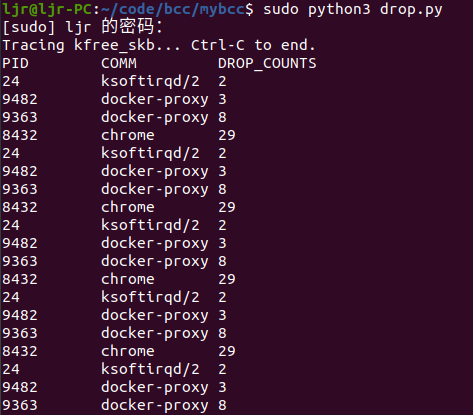
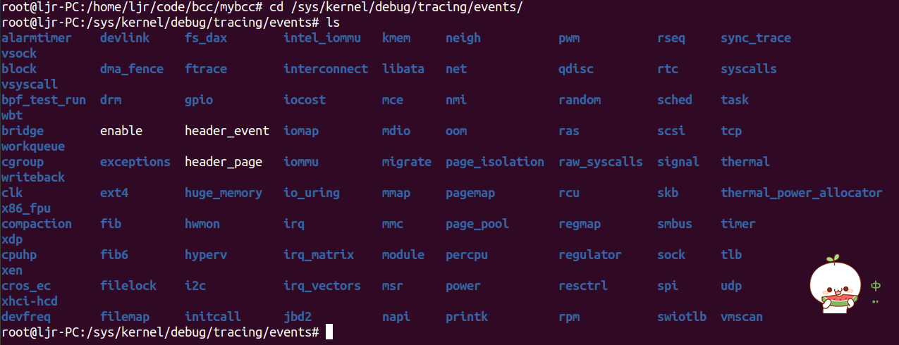
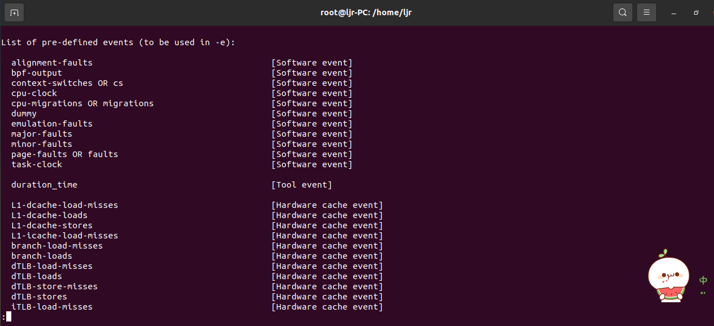
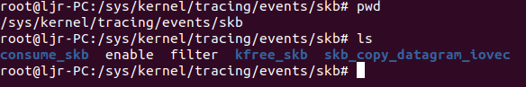

## 1. 前言

我们可以使用BPF对Linux内核进行跟踪，收集我们想要的内核数据，从而对Linux中的程序进行分析和调试。与其它的跟踪技术相比，使用BPF的主要优点是几乎可以访问Linux内核和应用程序的任何信息，同时，BPF对系统性能影响很小，执行效率很高，而且开发人员不需要因为收集数据而修改程序。

本文将介绍保证BPF程序安全的BPF验证器，然后以BPF程序的工具集BCC为例，分享kprobes和tracepoints类型的BPF程序的使用及程序编写示例。

## 2. BPF验证器
BPF借助跟踪探针收集信息并进行调试和分析，与其它依赖于重新编译内核的工具相比，BPF程序的安全性更高。重新编译内核引入外部模块的方式，可能会因为程序的错误而产生系统奔溃。BPF程序的验证器会在BPF程序加载到内核之前分析程序，消除这种风险。

BPF验证器执行的第一项检查是对BPF虚拟机加载的代码进行静态分析，目的是确保程序能够按照预期结束。验证器在进行第一项检查时所做工作为：
- 程序不包含控制循环；
- 程序不会执行超过内核允许的最大指令数；
- 程序不包含任何无法到达的指令；
- 程序不会超出程序界限。

BPF验证器执行的第二项检查是对BPF程序进行预运行，所做工作为：
- 分析BPF程序执行的每条指令，确保不会执行无效指令；
- 检查所有内存指针是否可以正确访问和引用；
- 预运行将程序控制流的执行结果通知验证器，确保BPF程序最终都会执行BPF_EXIT指令。
## 3. 内核探针 kprobes
内核探针可以跟踪大多数内核函数，并且系统损耗最小。当跟踪的内核函数被调用时，附加到探针的BPF代码将被执行，之后内核将恢复正常模式。
### 3.1 kprobes类BPF程序的优缺点
- 优点
动态跟踪内核，可跟踪的内核函数众多，能够提取内核绝大部分信息。
- 缺点
没有稳定的应用程序二进制接口，可能随着内核版本的演进而更改。
### 3.2 kprobes
kprobe程序允许在执行内核函数之前插入BPF程序。当内核执行到kprobe挂载的内核函数时，先运行BPF程序，BPF程序运行结束后，返回继续开始执行内核函数。下面是一个使用kprobe的bcc程序示例，功能是监控内核函数`kfree_skb`函数，当此函数触发时，记录触发它的进程pid，进程名字和触发次数，并打印出触发此函数的进程pid，进程名字和触发次数：
```python
#!/usr/bin/python3
# coding=utf-8
from __future__ import print_function
from bcc import BPF
from time import sleep
# define BPF program

bpf_program = """
#include <uapi/linux/ptrace.h>
struct key_t{
	u64 pid;
};
BPF_HASH(counts, struct key_t);
int trace_kfree_skb(struct pt_regs *ctx) {
	u64 zero = 0, *val, pid;
	pid = bpf_get_current_pid_tgid() >> 32;
	struct key_t key  = {};
	key.pid = pid;
    val = counts.lookup_or_try_init(&key, &zero);
    if (val) {
      (*val)++;
    }
    return 0;
}
"""

def pid_to_comm(pid):
    try:
        comm = open("/proc/%s/comm" % pid, "r").read().rstrip()
        return comm
    except IOError:
        return str(pid)

# load BPF

b = BPF(text=bpf_program)
b.attach_kprobe(event="kfree_skb", fn_name="trace_kfree_skb")

# header
print("Tracing kfree_skb... Ctrl-C to end.")
print("%-10s %-12s %-10s" % ("PID", "COMM", "DROP_COUNTS"))

while 1:
	sleep(1)
	for k, v in sorted(b["counts"].items(),key = lambda counts: counts[1].value):
	  	print("%-10d %-12s %-10d" % (k.pid, pid_to_comm(k.pid), v.value))
```
该bcc程序主要包括两个部分，一部分是python语言，一部分是c语言。python部分主要做的工作是BPF程序的加载和操作BPF程序的map，并进行数据处理。c部分会被llvm编译器编译为BPF字节码，经过BPF验证器验证安全后，加载到内核中执行。python和c中出现的陌生函数可以查下面这两个手册，在此不再赘述：

python部分遇到的陌生函数可以查这个手册：
[点此跳转](https://github.com/iovisor/bcc/blob/master/docs/reference_guide.md#bcc-python)

c部分中遇到的陌生函数可以查这个手册：
[点此跳转](https://github.com/iovisor/bcc/blob/master/docs/reference_guide.md#bpf-c)

需要说明的是，该BPF程序类型是kprobe，它是在这里进行程序类型定义的：
```c
b.attach_kprobe(event="kfree_skb", fn_name="trace_kfree_skb")
```
- `b.attach_kprobe()`指定了该BPF程序类型为kprobe；
- `event="kfree_skb"`指定了kprobe挂载的内核函数为`kfree_skb`；
- `fn_name="trace_kfree_skb"`指定了当检测到内核函数`kfree_skb`时，执行程序中的`trace_kfree_skb`函数；

>BPF程序的第一个参数总为ctx，该参数称为上下文，提供了访问内核正在处理的信息，依赖于正在运行的BPF程序的类型。CPU将内核正在执行任务的不同信息保存在寄存器中，借助内核提供的宏可以访问这些寄存器，如PT_REGS_RC。

程序运行结果如下：



### 3.3 kretprobes
相比于内核探针kprobe程序，kretprobe程序是在内核函数有返回值时插入BPF程序。当内核执行到kretprobe挂载的内核函数时，先执行内核函数，当内核函数返回时执行BPF程序，运行结束后返回。

以上面的BPF程序为例，若要使用kretprobe，可以这样修改：
```c
b.attach_kretprobe(event="kfree_skb", fn_name="trace_kfree_skb")
```
- `b.attach_kretprobe()`指定了该BPF程序类型为kretprobe，kretprobe类型的BPF程序将在跟踪的内核函数有返回值时执行BPF程序；
- `event="kfree_skb"`指定了kretprobe挂载的内核函数为`kfree_skb`；
- `fn_name="trace_kfree_skb"`指定了当内核函数`kfree_skb`有返回值时，执行程序中的`trace_kfree_skb`函数；

## 4. 内核静态跟踪点 tracepoint
tracepoint是内核静态跟踪点，它与kprobe类程序的主要区别在于tracepoint由内核开发人员在内核中编写和修改。
### 3.1 tracepoint 程序的优缺点
- 优点
跟踪点是静态的，ABI更稳定，不随内核版本的变化而致不可用。
- 缺点
跟踪点是内核人员添加的，不会全面涵盖内核的所有子系统。
### 3.2 tracepoint 可用跟踪点
系统中所有的跟踪点都定义在`/sys/kernel/debug/traceing/events`目录中：



使用命令`perf list` 也可以列出可使用的tracepoint点：



对于bcc程序来说，以监控`kfree_skb`为例，tracepoint程序可以这样写：

```c
b.attach_tracepoint(tp="skb:kfree_skb", fn_name="trace_kfree_skb")
```
bcc遵循tracepoint命名约定，首先是指定要跟踪的子系统，这里是“skb:”，然后是子系统中的跟踪点“kfree_skb”：




## 5. 总结
本文主要介绍了保证BPF程序安全的BPF验证器，然后以BPF程序的工具集BCC为例，分享了kprobes和tracepoints类型的BPF程序的使用及程序编写示例。本文分享的是内核跟踪，那么用户空间程序该如何跟踪呢，这将在后面的文章中逐步分享，感谢阅读。

参考资料：
- 若未安装bcc，请参考[这里](https://github.com/iovisor/bcc/blob/master/INSTALL.md)进行安装；
- bcc程序编写[指导手册](https://github.com/iovisor/bcc/blob/master/docs/reference_guide.md)
- 参考书《Linux内核观测技术 BPF》
