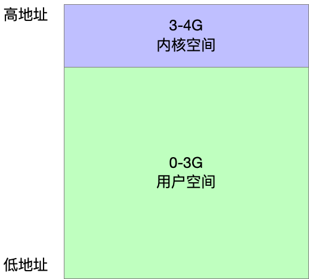
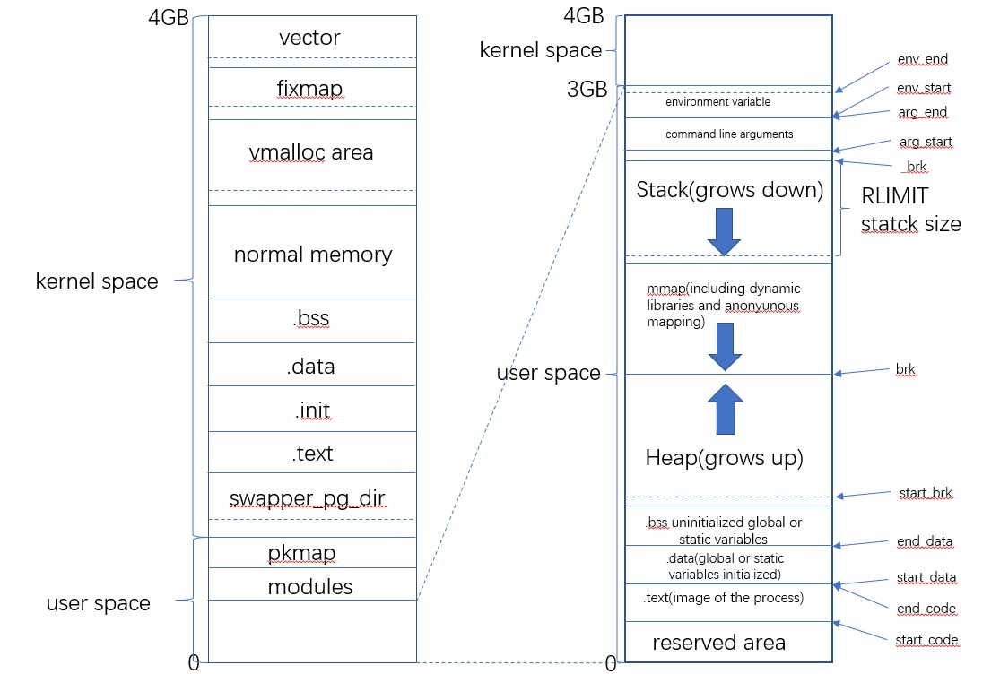
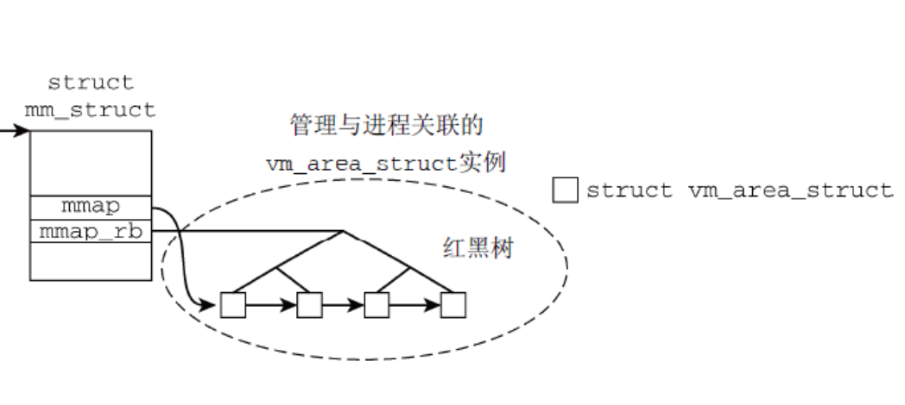
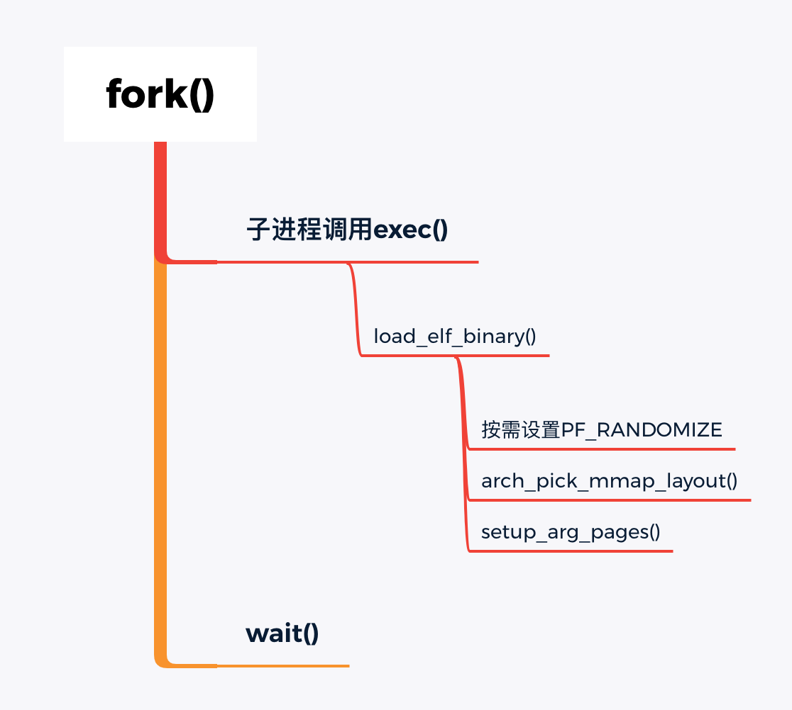
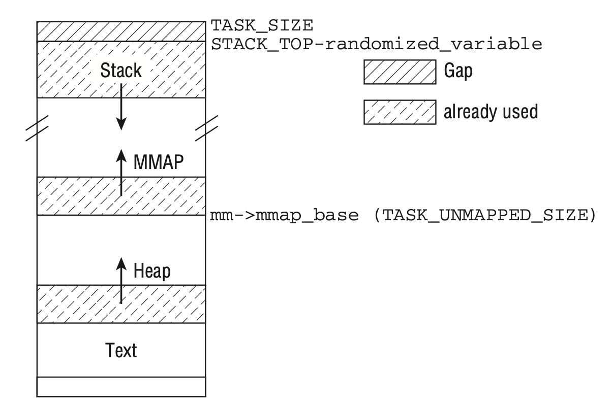
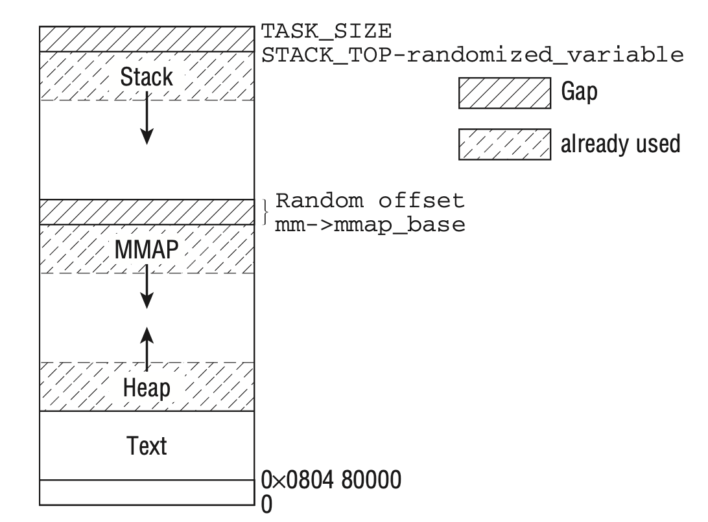

---
title: "Linux进程虚拟地址空间"
date: 2021-08-30T14:30:45+08:00
author: "梁金荣"
keywords: ["内存管理"]
categories : ["内存管理"]
banner : "img/blogimg/ljrimg13.jpg"
summary : "谈到Linux进程虚拟地址空间，还要从程序说起。本文通过分析程序的编译执行过程，分享了Linux进程虚拟地址空间的结构、组织和创建，并通过分析Linux内核源代码，总结了进程、进程虚拟地址空间和虚存区的关系。"
---

# 1. 前言
谈到Linux进程虚拟地址空间，还要从程序说起。本文通过分析程序的编译执行过程，分享了Linux进程虚拟地址空间的结构、组织和创建，并通过分析Linux内核源代码，总结了进程、进程虚拟地址空间和虚存区的关系。
# 2. 程序编译运行过程


我们编写好一个C程序后，经过预处理、编译、汇编、链接后，生成Linux中的可执行文件ELF文件。


# 3. 进程虚拟地址空间的结构
当我们运行可执行文件时，父进程通过fork系统调用创建子进程，可以理解为进程就是运行中的程序。在32位Linux系统中，每个进程都有4GB的虚拟地址空间，其中0-3GB是用户空间，3-4GB是内核空间。每个进程都以为自己独占整个4GB的地址空间，但实际上1GB的内核空间是所有进程共享的，独占的3GB用户空间也只是虚拟的。



**那么进程虚拟地址空间结构是什么样子呢？** 虚拟地址空间包含很多虚存区，它的结构和功能如下图所示。



内核中使用`vm_area_struct`描述进程虚拟地址空间中的虚存区，4.19内核中定义如下(include/linux/mm_types.h)：
```c
struct vm_area_struct {
	/* The first cache line has the info for VMA tree walking. */

	unsigned long vm_start;		/* Our start address within vm_mm. */
	unsigned long vm_end;		/* The first byte after our end address
					   within vm_mm. */

	/* linked list of VM areas per task, sorted by address */
	struct vm_area_struct *vm_next, *vm_prev;

	struct rb_node vm_rb;

	......

	struct mm_struct *vm_mm;	/* The address space we belong to. */
	pgprot_t vm_page_prot;		/* Access permissions of this VMA. */
	unsigned long vm_flags;		/* Flags, see mm.h. */

	......
	
	/* Function pointers to deal with this struct. */
	const struct vm_operations_struct *vm_ops;

	/* Information about our backing store: */
	unsigned long vm_pgoff;		/* Offset (within vm_file) in PAGE_SIZE
					   units */
	struct file * vm_file;		/* File we map to (can be NULL). */
	void * vm_private_data;		/* was vm_pte (shared mem) */
	
	......

} __randomize_layout;
```

关键信息：

- `vm_start`和`vm_end`指定了该虚存区在虚拟地址空间中的起始和结束地址。
- 进程所有的`vm_area_struct`描述的虚存区由红黑树和双向链表来组织，红黑树的根节点位于`mm_rb`，双向链表开始于`mm_struct->mmap`（下文会介绍`mm_struct`），由`vm_next`和`vm_prev`分别指向双向链表的后继和前驱。



>问：使用双向链表来组织进程的虚存区就好了，为什么还要用到红黑树呢？
>答：内核对虚存区进行操作时，需要找到特定地址关联的区域，而扫描链表是一种很低效的操作，尤其对于数据密集型应用（存在大量虚存区）。红黑树是一种二叉排序树，其节点标记为红色或黑色，节点的红黑标记可以简化重新平衡树的过程，它具有普通查找树的所有性质，添加、查找和删除都可以在O(logn)时间内完成。因此，进程的虚存区还使用红黑树来组织，可以明显加快虚存区的扫描速度。
>
- `vm_mm`是一个反向指针，指向该虚存区所属的`mm_struct`。
- `vm_page_prot`存储了该区域的访问权限。
- `vm_flags`是描述该区域的一组标志。
- `vm_ops`是一个指向很多方法集合的指针，这些方法用于在虚存区上执行各种操作，主要包括创建、删除等。
- `vm_file`指向了一个被映射的文件。

进程的虚拟地址空间中包含了上述的虚存区，**那么每个进程的虚拟地址空间又是如何管理的呢？** 内核中使用`mm_struct`结构管理进程的虚拟地址空间，4.19内核中定义如下(include/linux/mm_types.h)：
```c
struct mm_struct {
	struct {
		struct vm_area_struct *mmap;		/* list of VMAs */
		struct rb_root mm_rb;
		u64 vmacache_seqnum;                   /* per-thread vmacache */

     	......

		unsigned long task_size;	/* size of task vm space */
		unsigned long highest_vm_end;	/* highest vma end address */
		pgd_t * pgd;
		atomic_t mm_users;
		atomic_t mm_count;
		int map_count;			/* number of VMAs */

		......

		spinlock_t arg_lock; /* protect the below fields */
		unsigned long start_code, end_code, start_data, end_data;
		unsigned long start_brk, brk, start_stack;
		unsigned long arg_start, arg_end, env_start, env_end;

		......
		
	} __randomize_layout;

	/*
	 * The mm_cpumask needs to be at the end of mm_struct, because it
	 * is dynamically sized based on nr_cpu_ids.
	 */
	unsigned long cpu_bitmap[];
};
```

关键信息：

- `mmap`指向了进程虚拟地址空间中虚存区双链表开始的节点。
- `mm_rb`指向了虚存区红黑树的根节点。
- `task_size`描述了进程虚拟地址空间长度。
- `pgd`指向了页全局目录的初始地址。
- `start_code`和 `end_code`分别保存了可执行代码在虚存区的开始和结束地址， `start_data`和`end_data`分别保存了已初始化数据在虚存区的开始和结束地址。
- `start_brk`和`brk`分别保存了堆区域的开始和结束地址, `start_stack`保存了栈的开始地址。
- `arg_start`和 `arg_end`分别保存了参数列表的开始和结束地址, `env_start`和 `env_end`分别保存了环境变量的开始和结束地址。

# 4. 进程虚拟地址空间的创建
**那么进程的虚拟地址空间是怎么创建的呢？** Linux通过fork()创建新进程后，使用wait()等待子进程完成。子进程通过`exec`系统调用执行`load_elf_binary()`装载ELF二进制文件，创建新进程的地址空间。



创建进程虚拟地址空间时，首先，需要设置`PF_RANDOMIZE`,如果全局变量`randomize_va_space`设置为1，则启用地址空间随机化机制。该设置会降低计算机的速度，但是可以提高系统的安全性，因为该设置使得内核不会为栈和内核映射区选择固定的位置，每次新进程启动时改变这些值的设置，从而攻击者无法依靠固定的地址找到栈。

然后，内核使用`arch_pick_mmap_layout()`选择进程虚拟地址空间的布局。其布局常见的有两种，分别是经典布局和新布局。经典布局适用于计算机提供了巨大的虚拟地址空间，这取决于操作系统的位数。经典布局如下图所示，栈起始于`STACK_TOP`，内存映射区起始于`mm_struct`并向上扩展。



经典布局的问题在于堆的使用空间很小，新布局使用固定值限制栈的最大长度，内存映射区从栈的末端向下扩展。



4.19内核中选择布局的函数如下（arch/x86/mm/mmap.c）：

```c
void arch_pick_mmap_layout(struct mm_struct *mm, struct rlimit *rlim_stack)
{
	if (mmap_is_legacy())
		mm->get_unmapped_area = arch_get_unmapped_area;
	else
		mm->get_unmapped_area = arch_get_unmapped_area_topdown;

	arch_pick_mmap_base(&mm->mmap_base, &mm->mmap_legacy_base,
			arch_rnd(mmap64_rnd_bits), task_size_64bit(0),
			rlim_stack);

#ifdef CONFIG_HAVE_ARCH_COMPAT_MMAP_BASES
	/*
	 * The mmap syscall mapping base decision depends solely on the
	 * syscall type (64-bit or compat). This applies for 64bit
	 * applications and 32bit applications. The 64bit syscall uses
	 * mmap_base, the compat syscall uses mmap_compat_base.
	 */
	arch_pick_mmap_base(&mm->mmap_compat_base, &mm->mmap_compat_legacy_base,
			arch_rnd(mmap32_rnd_bits), task_size_32bit(),
			rlim_stack);
#endif
}
```
可以看到如果配置是legacy模式，则内核通过`arch_get_unmapped_area`函数设置经典布局，否则内核通过`arch_get_unmapped_area_topdown`设置内存映射自顶向下的新布局。`arch_pick_mmap_base()`函数选择内存映射的基地址。

最后，`load_elf_binary`函数调用`setup_arg_pages`在适当的位置创建栈。

# 5. 进程、虚拟地址空间和虚存区的关系

进程的虚拟地址空间的创建介绍完了，那么进程、进程的虚拟地址空间、虚存区它们是怎么联系起来的呢。通过分析内核源代码，姑且画出此图。


# 6. 结语
到此，我们了解了进程虚拟地址空间。那么，物理地址与虚拟地址它们有什么联系呢？Linux中物理地址是怎么管理和分配呢？下期文章继续分享，谢谢阅读。

参考资料：

《深入Linux内核架构》

《Linux内核设计与实现》

https://www.w3xue.com/exp/article/201811/10027.html

https://maodanp.github.io/2019/06/02/linux-virtual-space/

https://www.wulnut.top/2020/10/16/virtual_address/

https://www.cxyzjd.com/article/weixin_39832628/110994300

https://blog.csdn.net/gyx_2110/article/details/71329991

