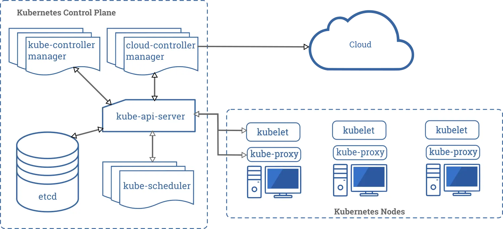
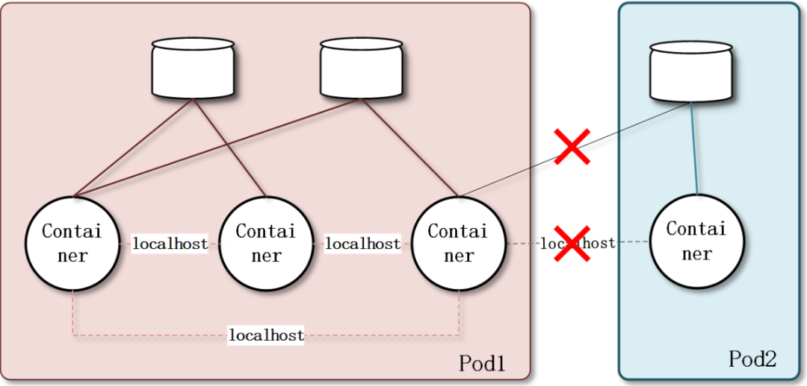
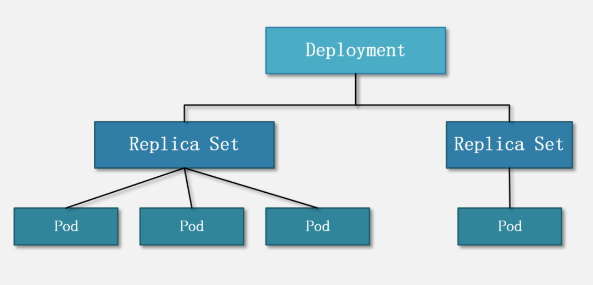
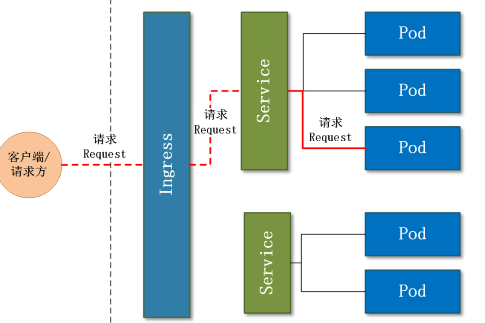
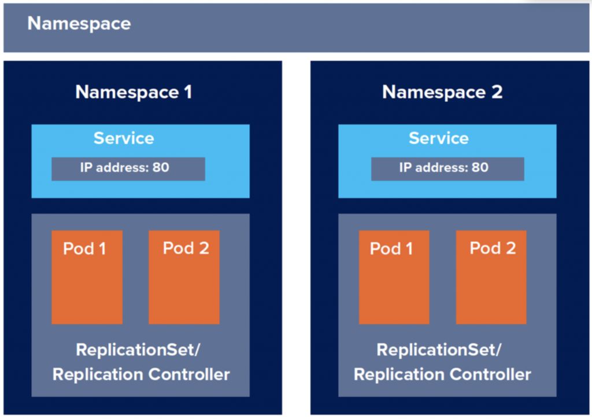
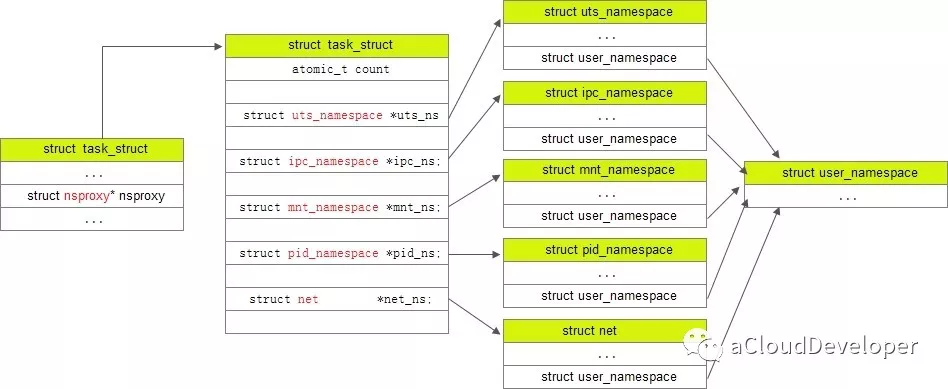

## 1. 前言

笔者论文是在Kubernetus场景下对网络进行优化，那么熟悉整个Kubernetus就显得尤为重要。本文将介绍Kubernetus的组件、重要术语以及如何在Kubernetus集群上部署服务，掌握了Kubernetus基本知识后，就可以针对该场景下的网络进行深入的研究了。下面笔者开始撰写Kubernetus自传。
## 2. Kubernetus介绍
从前，有一个人，叫做Kubernetus，因为他的名字太长了，所以被世人成为“k8s”。当时，云原生微服务发展迅速，CloudFoundry和Docker称霸一方，随着微服务的继续发展，容器出现了管理和运维不便的难题。这时候，Kubernetus站了出来，他产生了一个梦想，他要实现自动部署、扩展和管理容器化应用程序。如果没有梦想，就像鸟儿没有翅膀，长大以后无法飞翔，有梦想就会有动力，有动力就会产生能力。于是，k8s他开始了他的梦想之路。
## 3. Kubernetus组件
那么，k8s该怎么自动化运维管理多个 Docker 程序的集群呢?他又如何自动完成服务的部署、更新、卸载、扩容和缩容呢？

他设立了专门负责核心的调度、管理和运维的总部，叫做Master Node。他将容器化应用部署在专门干活的节点，叫做Work Node。所有 Master Node 和 Worker Node 组成了 K8S 集群，集群中每个Node对应一台物理机或虚拟机，同一集群可能存在多个Master Node 和Work Node。



### 3.1 Master Node
K8S 在 Master Node 上成立了管理部门，下面分别介绍它们的职能：
|Master Node 组件名| 功能 |
|--|--|
| kube-apiserver | kube-apiserver用于暴露Kubernetes API。任何的资源请求/调用操作都是通过kube-apiserver提供的接口进行。 |
| ETCD | etcd是Kubernetes提供默认的存储系统，保存所有集群数据，使用时需要为etcd数据提供备份计划。 |
| kube-controller-manager | kube-controller-manager运行管理控制器，它们是集群中处理常规任务的后台线程。 |
| cloud-controller-manager | 云控制器管理器负责与底层云提供商的平台交互。 |
| kube-scheduler | kube-scheduler 监视新创建没有分配到Node的Pod，为Pod选择一个Node。 |
| 插件 addons | 插件（addon）是实现集群pod和Services功能的 。 |
| DNS | 群集 DNS是一个DNS服务器，能够为 Kubernetes services提供 DNS记录。 |
| 用户界面 | kube-ui提供集群状态基础信息查看。 |
| 容器资源监测 | 容器资源监控提供一个UI浏览监控数据。 |
| Cluster-level Logging | Cluster-level logging 负责保存容器日志，搜索/查看日志。 |

> 对于kube-controller-manager，控制器包括：
> - 节点（Node）控制器。
> - 副本（Replication）控制器：负责维护系统中每个副本中的pod。
> - 端点（Endpoints）控制器：填充Endpoints对象（即连接Services＆Pods）。
> - Service Account和Token控制器：为新的Namespace 创建默认帐户访问API Token。

> 对于cloud-controller-manager ，它的具体功能是：
> - 节点（Node）控制器
> - 路由（Route）控制器
> - Service控制器
> - 卷（Volume）控制器

> 对于插件 addons 实现集群pod和Services功能，其中Pod由Deployments，ReplicationController等进行管理。Namespace 插件对象是在kube-system Namespace中创建。

### 3.2 Work Node
K8S 在 Work Node 上成立了执行部门，下面分别介绍它们的职能：
| Work Node 组件名 | 功能 |
|--|--|
| kubelet | kubelet是主要的节点代理，它会监视已分配给节点的pod。 |
| kube-proxy | kube-proxy通过在主机上维护网络规则并执行连接转发来实现Kubernetes服务抽象。 |
| docker | docker用于运行容器。 |
| RKT | rkt运行容器，作为docker工具的替代方案。 |
| supervisord | supervisord是一个轻量级的监控系统，用于保障kubelet和docker运行。 |
| fluentd | fluentd是一个守护进程，可提供cluster-level logging.。 |

## 4. Kubernetus重要术语
想要更加了解K8S集群，就要了解K8S集群中有哪些重要的人，下面就来介绍：
### 4.1 Pod
Pod 是什么？我们知道，“进程”是系统资源分配的最小单位，还有”线程“是CPU 调度的最小单位。据K8S介绍，Pod 他是 K8S 创建和管理的、最小的可部署的计算单元，他是可以共享网络、存储和计算资源的容器化服务的集合。同一个Pod中可能有多个容器 Container，并且 Container 之间可以通过 localhost 互相访问，还可以挂载 Pod 内所有的数据卷。不同的 Pod 之间的 Container 不能用 localhost 访问，也不能挂载其他 Pod 的数据卷。



K8S 中所有的对象都通过 yaml 来表示，现在看一个最简单的 Pod 的 yaml：
```yaml
apiVersion: v1
kind: Pod
metadata:
  name: memory-demo
  namespace: mem-example
spec:
  containers:
  - name: memory-demo-ctr
    image: polinux/stress
    resources:
      limits:
        memory: "200Mi"
      requests:
        memory: "100Mi"
    command: ["stress"]
    args: ["--vm", "1", "--vm-bytes", "150M", "--vm-hang", "1"]
    volumeMounts:
    - name: redis-storage
      mountPath: /data/redis
  volumes:
  - name: redis-storage
    emptyDir: {}
```
- apiVersion记录 K8S 的 API Server 版本。
- kind记录该 yaml 的对象，比如这是一份 Pod 的 yaml 配置文件，那么值内容就是Pod。
- metadata记录了 Pod 自身的元数据，比如这个 Pod 的名字、这个 Pod 属于哪个 namespace。
- spec记录了 Pod 内部所有的资源的详细信息。containers记录了 Pod 内的容器信息，containers包括了：name容器名，image容器的镜像地址，resources容器需要的 CPU、内存、GPU 等资源，command容器的入口命令，args容器的入口参数，volumeMounts容器要挂载的 Pod 数据卷等。
- volumes记录了 Pod 内的数据卷信息，后文会详细介绍 Pod 的数据卷。

### 4.2 Volume 数据卷
volume 是 Pod 内部的磁盘资源。volumeMounts和volume有什么关系呢？ volume 是 K8S 的对象，对应一个实体的数据卷；而 volumeMounts 只是 container 的挂载点，对应 container 的其中一个参数。volumeMounts 依赖于 volume，只有当 Pod 内有 volume 资源的时候，该 Pod 内部的 container 才可能有 volumeMounts。

### 4.3 Container 容器
一个Pod中可以有多个容器，这些容器可以是：
- 标准容器 Application Container
- 初始化容器 Init Container
- 边车容器 Sidecar Container
- 临时容器 Ephemeral Container
一般情况下，我们部署的是标准容器（ Application Container）。
### 4.4 Deployment 和 ReplicaSet（简称 RS）
Deployment 的作用是管理和控制 Pod 和 ReplicaSet，管控它们运行在用户期望的状态中。
ReplicaSet 的功能是维护一组在任何时候都处于运行状态的 Pod 副本的稳定集合。



### 4.5 Service 和 Ingress
Service 和 Ingress 主要负责管控 Pod 网络服务。Service 主要管理集群内部网络，Ingress 主要负责集群外部访问集群内部。

> Service 官方定义：
将运行在一组 Pods 上的应用程序公开为网络服务的抽象方法。使用 Kubernetes，您无需修改应用程序即可使用不熟悉的服务发现机制。Kubernetes 为 Pods 提供自己的 IP 地址，并为一组 Pod 提供相同的 DNS 名， 并且可以在它们之间进行负载均衡。

Service 说白了就是若干个 Pod 的流量入口、流量均衡器。Service 是 K8S 服务的核心，屏蔽了服务细节，统一对外暴露服务接口，真正做到了“微服务”。举个例子，我们的一个服务 A，部署了 3 个备份，也就是 3 个 Pod；对于用户来说，只需要关注一个 Service 的入口就可以，而不需要操心究竟应该请求哪一个 Pod。优势非常明显：一方面外部用户不需要感知因为 Pod 上服务的意外崩溃、K8S 重新拉起 Pod 而造成的 IP 变更，外部用户也不需要感知因升级、变更服务带来的 Pod 替换而造成的 IP 变化，另一方面，Service 还可以做流量负载均衡。

Ingress 是整个 K8S 集群的接入层，复杂集群内外通讯。



### 4.6 namespace 命名空间
Linux Namespace是一种Linux Kernel提供的资源隔离方案，提供Pid，Network，Ipc，Uts，Mount等资源的隔离，每个Namespace下的这些资源对于其他Namespace是不可见的。



Linux源码中，进程描述符`task_struct`就有 namespace 相应的字段：
```c
struct task_struct {
      ...
      /* namespaces */
      struct nsproxy *nsproxy;
      ...
}
```
`nsproxy` 结构体的定义：
```c
/*
 * A structure to contain pointers to all per-process
 * namespaces - fs (mount), uts, network, sysvipc, etc.
 *
 * The pid namespace is an exception -- it's accessed using
 * task_active_pid_ns.  The pid namespace here is the
 * namespace that children will use.
 *
 * 'count' is the number of tasks holding a reference.
 * The count for each namespace, then, will be the number
 * of nsproxies pointing to it, not the number of tasks.
 *
 * The nsproxy is shared by tasks which share all namespaces.
 * As soon as a single namespace is cloned or unshared, the
 * nsproxy is copied.
 */
struct nsproxy {
	atomic_t count;
	struct uts_namespace *uts_ns;
	struct ipc_namespace *ipc_ns;
	struct mnt_namespace *mnt_ns;
	struct pid_namespace *pid_ns_for_children;
	struct net 	     *net_ns;
	struct cgroup_namespace *cgroup_ns;
};
extern struct nsproxy init_nsproxy;
```
只要namespace被clone了，那么nsproxy就会跟着被clone。 同时，nsproxy.h中定义了一些对namespace的操作，包括copy_namespaces等：
```c
int copy_namespaces(unsigned long flags, struct task_struct *tsk);
void exit_task_namespaces(struct task_struct *tsk);
void switch_task_namespaces(struct task_struct *tsk, struct nsproxy *new);
void free_nsproxy(struct nsproxy *ns);
int unshare_nsproxy_namespaces(unsigned long, struct nsproxy **,
	struct cred *, struct fs_struct *);
int __init nsproxy_cache_init(void);

static inline void put_nsproxy(struct nsproxy *ns)
{
	if (atomic_dec_and_test(&ns->count)) {
		free_nsproxy(ns);
	}
}

static inline void get_nsproxy(struct nsproxy *ns)
{
	atomic_inc(&ns->count);
}
```
`task_struct`，`nsproxy`，几种 namespace 之间的关系：



## 5. 总结
本文介绍了K8S集群，总结了K8S Master Node 和 Work Node 的组件，并对常见术语进行了解释。接下来，将总结 K8S 服务部署以及集群网络实现原理。

参考资料：

http://docs.kubernetes.org.cn/230.html

https://cloud.tencent.com/developer/article/1766527

https://www.redhat.com/zh/topics/containers/kubernetes-architecture

https://kubernetes.io/zh/docs/concepts/overview/components/

https://blog.csdn.net/M2l0ZgSsVc7r69eFdTj/article/details/80074534

https://cloud.tencent.com/developer/article/1096434

http://abcdxyzk.github.io/blog/2015/08/06/namespace2/

https://www.cnblogs.com/bakari/p/8823642.html