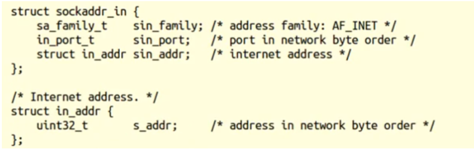
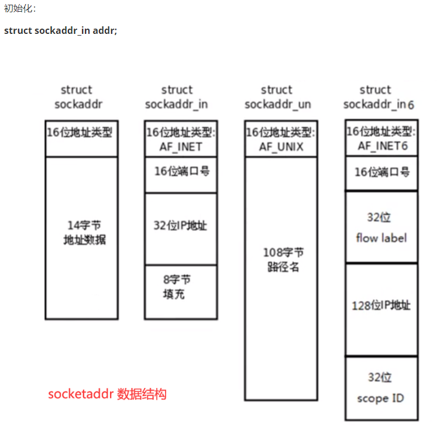

#  socket 编程

网络编程就是编写程序使两台联网的计算机相互交换数据。这就是全部内容了吗？是的！网络编程要比想象中的简单许多。


那么，这两台计算机之间用什么传输数据呢？首先需要物理连接。如今大部分计算机都已经连接到互联网，因此不用担心这一点。

在此基础上，只需要考虑如何编写数据传输程序。但实际上这点也不用愁，因为操作系统已经提供了socket。即使对网络数据传输的原理不太熟悉，我们也能通过 socket 来编程。

## 什么是 socket？

socket 的原意是“插座”，在计算机通信领域，socket 被翻译为“套接字”，它是计算机之间进行通信的一种约定或一种方式。通过 socket 这种约定，一台计算机可以接收其他计算机的数据，也可以向其他计算机发送数据。

我们把插头插到插座上就能从电网获得电力供应，同样，为了与远程计算机进行数据传输，需要连接到因特网，而 socket 就是用来连接到因特网的工具。


socket 的典型应用就是 Web 服务器和浏览器：浏览器获取用户输入的 URL，向服务器发起请求，服务器分析接收到的 URL，将对应的网页内容返回给浏览器，浏览器再经过解析和渲染，就将文字、图片、视频等元素呈现给用户。

学习 socket，也就是学习计算机之间如何通信，并编写出实用的程序。

## UNIX/Linux 中的 socket 是什么？

在 UNIX/Linux 系统中，为了统一对各种硬件的操作，简化接口，不同的硬件设备也都被看成一个文件。对这些文件的操作，等同于对磁盘上普通文件的操作。

你也许听很多高手说过，UNIX/Linux 中的一切都是文件！那个家伙说的没错。

为了表示和区分已经打开的文件，UNIX/Linux 会给每个文件分配一个 ID，这个 ID 就是一个整数，被称为

文件描述符（File Descriptor）

。例如：

- 通常用 0 来表示标准输入文件（stdin），它对应的硬件设备就是键盘；
- 通常用 1 来表示标准输出文件（stdout），它对应的硬件设备就是显示器。

UNIX/Linux 程序在执行任何形式的 I/O 操作时，都是在读取或者写入一个文件描述符。一个文件描述符只是一个和打开的文件相关联的整数，它的背后可能是一个硬盘上的普通文件、FIFO、管道、终端、键盘、显示器，甚至是一个网络连接。

请注意，网络连接也是一个文件，它也有文件描述符！你必须理解这句话。

我们可以通过 socket() 函数来创建一个网络连接，或者说打开一个网络文件，socket() 的返回值就是文件描述符。有了文件描述符，我们就可以使用普通的文件操作函数来传输数据了，例如：

- 用 read() 读取从远程计算机传来的数据；
- 用 write() 向远程计算机写入数据。

你看，只要用 socket() 创建了连接，剩下的就是文件操作了，网络编程原来就是如此简单！

## Window 系统中的 socket 是什么？

Windows 也有类似“文件描述符”的概念，但通常被称为“文件句柄”。因此，本教程如果涉及 Windows 平台将使用“句柄”，如果涉及 Linux 平台则使用“描述符”。


与 UNIX/Linux 不同的是，Windows 会区分 socket 和文件，Windows 就把 socket 当做一个网络连接来对待，因此需要调用专门针对 socket 而设计的数据传输函数，针对普通文件的输入输出函数就无效了。


## func htonl

> (本地->网络)  转IP


## func htons

> (本地->网络)  转端口


## func ntohl

> (网络->本地)  转IP


## func ntohs

> (网络->本地)  转端口


## IP地址转换函数

### func inet_pton() 

> IP地址转换 <本地字节序 -> 网络字节序>

int inet_pton(int af，const char *src, void *dst) ;

af:协议类型 

- AF_INET
- AF_INET6

src: <传入> IP地址 

- 点分十进制

dst: <传出> 转换后的网络字节序的 IP地址

返回值：

- 1：成功
- 0：src不是有效地址 
- -1：失败 


### func inet_ntop() 

> < 网络字节序 ->本地字节序>

const char *inet_ntop(int af，const void *src，char *dst,  socklen_t size);

af:协议类型 

- AF_INET
- AF_INET6

src: <传入> 网络字节序的IP地址 

- 二进制

dst: <传出> 转换后的本地字节序的 IP地址

size：dst的大小

返回值：dst

- dst：成功
- null：失败 


## socketaddr数据结构

**strcut sockaddr**很多网络编程函数诞生早于IPv4协议，那时候都使用的是 **sockaddr**结构体,为了向前兼容，现在**sockaddr**退化成了(void *)的作用，传递一个地址给函数，至于这个函数是**sockaddr_in**还是 **sockaddr_in6**，由地址族确定，然后函数内部再 强制类型转化为所需的地址类型。





和C语言一样，我们从一个简单的“Hello World!”程序切入 Socket 编程。

我找到了 Linux 下的socket代码，server.cpp 是服务器端代码，client.cpp 是客户端代码，要实现的功能是：客户端从服务器读取一个字符串并打印出来。还需要时间去消化一下：

```c++
//server.cpp
#include <stdio.h>
#include <string.h>
#include <stdlib.h>
#include <unistd.h>
#include <arpa/inet.h>
#include <sys/socket.h>
#include <netinet/in.h>

int main(){
   //创建套接字
   int serv_sock = socket(AF_INET, SOCK_STREAM, IPPROTO_TCP); 

   //将套接字和IP、端口绑定
   struct sockaddr_in serv_addr;
   memset(&serv_addr, 0, sizeof(serv_addr));  //每个字节都用0填充
   serv_addr.sin_family = AF_INET;  //使用IPv4地址
   serv_addr.sin_addr.s_addr = inet_addr("127.0.0.1");  //具体的IP地址
   serv_addr.sin_port = htons(1234);  //端口
   bind(serv_sock, (struct sockaddr*)&serv_addr, sizeof(serv_addr));

   //进入监听状态，等待用户发起请求
   listen(serv_sock, 20);

   //接收客户端请求
   struct sockaddr_in clnt_addr;
   socklen_t clnt_addr_size = sizeof(clnt_addr);
   int clnt_sock = accept(serv_sock, (struct sockaddr*)&clnt_addr, &clnt_addr_size);

   //向客户端发送数据
   char str[] = "http://c.biancheng.net/socket/";
   write(clnt_sock, str, sizeof(str));
  
   //关闭套接字
   close(clnt_sock);
   close(serv_sock);

   return 0;
} 
```

```
 socket() 函数创建了一个套接字，参数 AF_INET 表示使用 IPv4 地址，SOCK_STREAM 表示使用面向连接的套接字，IPPROTO_TCP 表示使用 TCP 协议。在 Linux 中，socket 也是一种文件，有文件描述符，可以使用 write() / read() 函数进行 I/O 操作
```

```
bind() 函数将套接字 serv_sock 与特定的 IP 地址和端口绑定，IP 地址和端口都保存在 sockaddr_in 结构体中,socket() 函数确定了套接字的各种属性，bind() 函数让套接字与特定的IP地址和端口对应起来，这样客户端才能连接到该套接字
```

```
 accept() 函数用来接收客户端的请求。程序一旦执行到 accept() 就会被阻塞（暂停运行），直到客户端发起请求。
```

```
write() 函数用来向套接字文件中写入数据，也就是向客户端发送数据
```

```
socket 在使用完毕后也要用 close() 关闭。
```


```c++
//client.cpp
#include <stdio.h>
#include <string.h>
#include <stdlib.h>
#include <unistd.h>
#include <arpa/inet.h>
#include <sys/socket.h>
int main(){
   //创建套接字
   int sock = socket(AF_INET, SOCK_STREAM, 0);
   //向服务器（特定的IP和端口）发起请求
   struct sockaddr_in serv_addr;
   memset(&serv_addr, 0, sizeof(serv_addr));  //每个字节都用0填充
   serv_addr.sin_family = AF_INET;  //使用IPv4地址
   serv_addr.sin_addr.s_addr = inet_addr("127.0.0.1");  //具体的IP地址
   serv_addr.sin_port = htons(1234);  //端口
   connect(sock, (struct sockaddr*)&serv_addr, sizeof(serv_addr));
  
   //读取服务器传回的数据
   char buffer[40];
   read(sock, buffer, sizeof(buffer)-1);
  
   printf("Message form server: %s\n", buffer);
  
   //关闭套接字
   close(sock);
   return 0;
}
```

```
connect() 向服务器发起请求，服务器的IP地址和端口号保存在 sockaddr_in 结构体中。
直到服务器传回数据后，connect() 才运行结束。
```

```
通过 read() 从套接字文件中读取数据。
```

