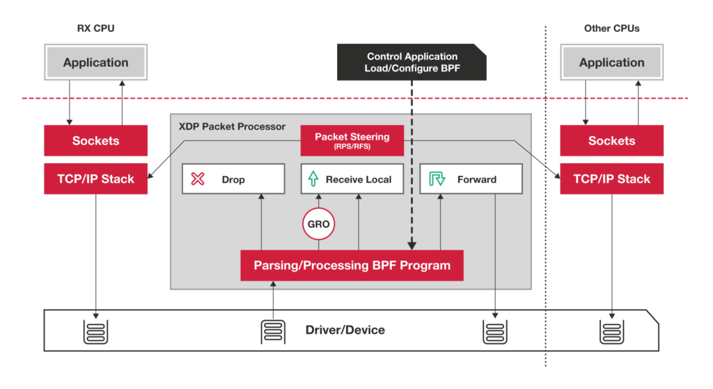

XDP，全称为**eXpress Data Path**，是Linux内核网络栈的最底层集成的数据包处理器。它只存在于RX路径上，当网络包到达内核时，XDP程序会在早期被执行 。


> RX：Receive（接收）
>
> TX：Transport（发送）


在这种情况下，因为内核还没有对数据包本身进行太多的处理，所以**显示数据包的信息非常有限**。但因为代码在数据包初期被执行，所以程序对数据包的处理**具有更高级别的控制**。  


在没有引入XDP之前，原来的网络数据包传输路径：


```
NIC设备-->Driver-->Traffic Control-->Netfilter-->TCP stack-->Socket
```


引入XDP之后，网络数据包传输路径：


```
NIC设备-->Driver-->Traffic Control-->Netfilter-->TCP stack-->Socket
|        |      |
XDP      XDP    XDP
```


1. Offlan XDP：XDP的BPF程序直接hook到可编程网卡硬件设备上，而不是在主机CPU上执行。因为该模式将执行从CPU上移出，并且处于数据链路的最前端，过滤效率与性能最高。**如果需要使用这种模式，需要在加载程序时明确声明。**
2. Native XDP：这是默认模式，XDP的BPF程序在网络驱动程序的早期接收路径之外直接运行。
3. Generic XDP：可以在没有硬件或驱动程序支持的主机上执行上执行XDP的BPF程序。缺点：**仿真执行，需要分配额外的套接字缓冲区，导致性能下降。**


XDP数据包处理器可以在XDP数据包上执行BPF程序，并协调BPF程序和网络栈之间的交互。


数据包处理器处理器保证数据包是可读写的，并允许以操作的形式附加处理后决策。


数据包处理器可以在运行时原子地更新程序和加载新程序，并且不会导致网络和相关流量中断服务。


在运行时，XDP可以使用“忙轮询”模式，在这种模式下，CPU会一直保持处理每个RX队列上的数据包，由于避免了上下文切换，可以使得数据包到达后立即被处理，无论IRQ亲和性如何。


另一方面，XDP可以使用的另一模式是“中断驱动”模式，在该模式下，CPU可以进行其他处理，当接收到数据包时，会产生一个事件中断行为指令，通知CPU在继续正常处理的同时必须处理一个新事件。


```c
enum xdp_action {
	XDP_ABORTED = 0,
	XDP_DROP,
	XDP_PASS,
	XDP_TX,
	XDP_REDIRECT,
};
```


- XDP_DROP（丢弃）

  丢弃数据包。

  这发生在驱动程序的最早RX阶段；丢弃数据包仅意味着将数据包回收到刚刚“到达”的RX环形队列中。

  丢弃的数据包将尽可能少地占用CPU处理时间和功耗。

- XDP_TX（转发）

  转发数据包。

  这可能在数据包被修改前或修改后发生；转发数据包意味着将接收到的数据包发送回数据包到达的同一网卡。

- XDP_REDIRECT（重定向）

  与XDP_TX相似，重定向也用于传递XDP数据包，但是重定向是通过另一个网卡传输或者传入到BPF的cpumap中。

  对于传入到BPF的cpumap场景，则CPU继续为网卡的接收队列提供XDP处理，并将处理上层内核栈的数据包推送给远程CPU，这类似于XDP_PASS，但是XDP的BPF程序可以继续为传入的高负载提供服务，而不仅是暂时把当前数据包推送到上层内核栈。

- XDP_PASS（传递）

  将数据包传递到普通网络栈进行处理。

  这等效于没有XDP的默认数据包处理行为。

  这可以通过以下两种方式之一来完成：

  - 正常方式接收数据包，分配元数据sk_buff结构并且将接收数据包入栈，然后将数据包引导到另一个CPU进行处理。它允许原始接口到用户空间进行处理。这可能发生在数据包被修改之前或被修改之后。
  - 通用接收卸载（GRO）方式接收大的数据包，并且合并相同连接的数据包。经过处理后，GRO最终将数据包传入“正常接收”流。

- XDP_ABORTED（错误）

  表示eBPF程序错误，并导致数据包被丢弃。

  程序不应该将它作为返回码。

  例如，如果程序除以零，则将返回XDP_ABORTED。XDP_ABORTED的值始终为零。我们可以通过trace_xdp_exception跟踪点进行额外监控来检测不良行为。





XDP暴露的钩子具有特定的输入上下文，它是单一输入参数。它的类型为struct xdp_md。


```c
struct xdp_md {
	__u32 data;
	__u32 data_end;
	__u32 data_meta;
	/* Below access go through struct xdp_rxq_info */
	__u32 ingress_ifindex; /* rxq->dev->ifindex */
	__u32 rx_queue_index;  /* rxq->queue_index  */
};
```


`data`和`data_ened`字段分别是数据包开始和结束的指针，它们是用来获取和解析传来的数据；

`data_meta`指针，初始阶段它是一个空闲的内存地址，供XDP程序与其他层交换数据包元数据时使用；

`ingress_ifindex`是接收数据包的接口；

`rx_queue_index`是对应的RX队列的索引。


`iproute2`提供的ip命令具有充当XDP前端的能力，可以将XDP程序编译成ELF文件并加载它，并且完全支持映射、映射重定向、尾部调用和对象持久化。


命令：`ip link set dev [device name] xdp obj xdp-program.o sec [section name]`


- ip：调用ip命令；
- link：配置网络接口；
- set：更改设备属性；
- dev [device name]：指定我们要在其上操作和加载XDP程序的网络设备；
- xdp obj xdp-program.o：从名为xdp-program.o的ELF文件（对象）中加载XDP程序。该命令的xdp部分告诉系统当本地驱动可用时，使用本地驱动程序，否则回退到使用Generic驱动程序。你也可以通过使用更具体的选择器来强制使用一种模式：
  - xdpgeneric：使用Generic XDP模式；
  - xdpdrv：使用Native XDP模式；
  - xdpoffland：使用Offland XDP模式。
- sec [section name]：指定section名，此为从ELF文件中加载的BPF程序。如果未指定，section默认为prog。如果程序中未指定任何的section，则必须在ip调用中指定sec.txt。


当使用`iproute2`作为加载器时，你可以跳过自己编写加载器的部分。


如果自己用C语言写加载部分，就相对比较麻烦了。


内核部分：


```c
SEC("program_name")
int xdp_prog(struct xdp_md *ctx)
{
    ......
    return xdp_action;
}
```


用户部分：


```c
// 加载的部分代码
int main(int argc, char **argv)
{
    struct bpf_prog_load_attr prog_load_attr = {
        .prog_type = BPF_PROG_TYPE_XDP,
    };
    const char *prog_name = "program_name";
    struct bpf_program *prog;
    int prog_fd;
    char filename[PATH_MAX];
    struct bpf_object *obj;
    int opt, i, idx, err;
    
    snprintf(filename, sizeof(filename), "%s_kern.o", argv[0]);
    prog_load_attr.file = filename;
    
    err = bpf_prog_load_xattr(&prog_load_attr, &obj, &prog_fd);
    
    prog = bpf_object__find_program_by_title(obj, program);
    prog_fd = bpf_program__fd(prog);
    
    map_fd = bpf_map__fd(bpf_object__find_map_by_name(obj, "map_name"));
    
    err = do_attach(.., prog_fd, map_fd, ..);
}
```


参考资料：

《Linux内核观测技术BPF》

[你的第一个XDP BPF程序](https://davidlovezoe.club/wordpress/archives/937)

[eXpress数据路径](https://www.iovisor.org/technology/xdp)

Linux源码下：/sample/bpf/xdp部分示例


