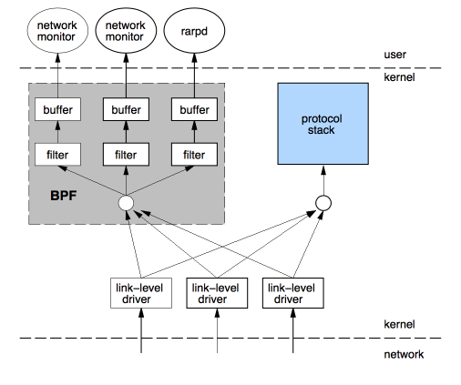
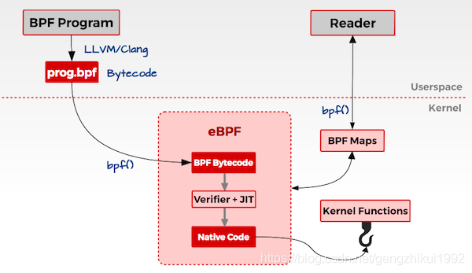

# eBPF介绍

## 摘要：

本文主要是对eBPF进行简单的介绍，带大家了解eBPF是什么、通过eBPF可以做些什么事情。

1. 源头起源于一篇1992年的论文

这篇论文主要提出一种新的网络数据包的过滤的框架，如下图所示。



提出的原因其实也很简单，早期我们从网卡中接收到很多的数据包，我们要想从中过滤出我们想要的数据包，我们需要将网卡接收的数据包都要从内核空间拷贝一份到用户空间。然后，用户程序在对这些进行过滤。那么，我们可以从中就能够发现一个问题。数据包必须全部拷贝。然后再过滤出所需的数据包，那么对于那些不需要的数据包，我们拷贝的操作是无效的、浪费的。对于内存数据的拷贝是很费cpu系统的资源的。所以，这篇论文，就提出了一种新的框架，在内核中直接过滤，这也可以避免一些无用的、浪费的拷贝。其背后的思想其实就是：与其把数据包复制到用户空间执行用户态程序过滤，不如把过滤程序灌进内核去。

这种新的框架，其实还是很容易理解的。大概的理解就是，当我们从网卡接收到一个数据包的时候，我们数据链路层，将数据包额外的拷贝一份。然后这个新的数据包就交给BPF程序进行处理，这个BPF根据用户编写的过滤规则对这个新的数据包进行匹配。如果符合此规则就将数据包放到接收队列中，那么用户事后就可以从接收队列中将这个数据包从内核空间拷贝到用户空间，这样就减少了无用的数据包的拷贝。

像tcpdump/wireshark等用户工具就是基于BPF框架实现的。其大概实现的过程就是，编写BPF指令集的过滤规则，然后创建raw/packet类型的套接字socket，将网卡设置为混杂模式。在通过setsockopt函数将BPF代码拷贝到内核，并attach到相关联的socket套接字上。当网卡接收到数据包的时候，因为设置的混杂模式，那么就会额外的拷贝一份新的数据包，然后在根据BPF的代码进行过滤，将符合规则的数据包接收到socket套接字的接收队列里面。最后用户程序就可以从这个接收队列获取到过滤后的数据包了。这类工具的实现流程就是大概这个样子。

2. 伪机器码、BPF指令集、JIT

使用过tcpdump工具的应该都见过在tcpdump命令后面会加一些表达式，用来表示过滤规则。

如:```sudo tcpdump -d -i lo tcp and dst port 7070```

注意不要以为这个表达式就是BPF程序了，其实这不是的。这个表达式是要经过编译过后才会变成BPF程序的。在我们早期是生产这类编译器，那么是如何将这个表达式编译出BPF指令集的呢？

tcpdump的实现是基于libcap库的，tcpdump使用的过滤表达式是使用libcap库进行解析的，生成我们BPF指令集。那为什么没有单独做成一个这类的编译器？究其原因就是但是的BPF框架使用的功能较少，只用在了网络的数据包过滤方面。除此之外，当时的BPF指令集个数很少，所以没有必要花费大量的资源单独做一个编译器。但是随着BPF的发展，指令集的复杂、支持的BPF程序类型越来越多，就急需要一个编译器了。那这个就是我们后面将要提到的eBPF和clang/llvm编译器了。

伪机器码：假的机器码，机器码都是能够在物理机上直接执行的，伪机器码不能够直接执行，需要在虚拟机上执行。

BPF指令集：BPF指令集就是一个伪机器码，是不能够在物理机上直接执行的，需要一个虚拟机才能够执行。我们都知道不同的处理器体系结构有自己的不同指令集，这边的BPF指令集可以理解为在BPF虚拟机上执行的指令集。

JIT：just in time 的缩写，我们将编译好的BPF指令集需要在虚拟机上执行，虚拟机需要一条一条的解析为本机机器码才能够执行，所以这个执行效率会很低，但是如果我们的处理器有了JIT就能够将我们BPF直接直接编译为能够在机器直接执行的机器码，这样大大提高了执行的速度。

3. eBPF介绍

eBPF是extend BPF的简称，扩展的BPF。我们刚了解BPF了，都知道BPF的功能比较单一只能够作用于网路的数据包的过滤上，但是扩展后的BPF的功能得到了很大的丰富，可以这样说基本上可以使用在Linux各个子系统中。除了功能上的扩展，BPF程序的指令集也变得相当复杂了，所以就出现了专门用于编译BPF程序的clang/llvm编译。在框架上BPF的框架也发生了变化，所以扩展后的BPF不再是早期的BPF的可以比拟的。因而，早期的BPF被称为cBPF，扩展后的BPF被称为eBPF。

现在看下扩展后的BPF的框架，如下图所示：


注意：我们后面说的BPF指的是cBPF和eBPF的统称，除非特别说明。

虽然，框架发生变化，但是其基本的思想还没有发生变化的。都是将BPF程序进行编译后生成字节码，然后将BPF字节码注入到内核中，当发生事件触发的时候，我们就会执行相应的BPF程序。

现在，我们对cBPF和eBPF进行对比：

一、cBPF支持的功能比较单一，只能够作用于网络的数据包的过滤上。而eBPF除了能够支持网络的数据包的过滤上，也支持其他的事件类型，如上图中的XDP、Perf Event、kprobe、tracepoint等等。cBPF的功能在eBPF其实对应的就是Socket的部分。

二、引入Map机制。在cBPF我们通过接收队列将过滤后数据获取出来，但是在eBPF我们可以将数据放到Map空间中。Map空间是用户空间和内核空间共享的，所以一般是在内核中将数据存入到Map空间中，然后在用户空间取出数据。

三、指令集变得更复杂了，与此同时，有了专门的用于编译BPF字节码的编译器clang/llvm。

四、还有在安全机制方面等等一些改变。

4. eBPF类型和Map机制

首先，看下eBPF支持的类型，其中BPF_PROG_TYPE_SOCKET_FILTER对应的就是早期cBPF的功能。只不过在eBPF中使用的框架不再是以前的cBPF的框架了，但是其实现的功能是一样的。

| **bpf_prog_type**               | **BPF prog 入口参数(R1)**                                   | **程序类型**                                                 |
| ------------------------------- | ----------------------------------------------------------- | ------------------------------------------------------------ |
| **BPF_PROG_TYPE_SOCKET_FILTER** | **struct __sk_buff**                                        | 用于过滤进出口网络报文，功能上和 cBPF 类似。                 |
| **BPF_PROG_TYPE_KPROBE**        | **struct pt_regs**                                          | 用于 kprobe 功能的 BPF 代码。                                |
| **BPF_PROG_TYPE_TRACEPOINT**    | 这类 BPF 的参数比较特殊，根据 tracepoint 位置的不同而不同。 | 用于在各个 tracepoint 节点运行。                             |
| **BPF_PROG_TYPE_XDP**           | **struct xdp_md**                                           | 用于控制 XDP(eXtreme Data Path)的 BPF 代码。                 |
| **BPF_PROG_TYPE_PERF_EVENT**    | **struct bpf_perf_event_data**                              | 用于定义 perf event 发生时回调的 BPF 代码。                  |
| **BPF_PROG_TYPE_CGROUP_SKB**    | **struct __sk_buff**                                        | 用于在 network cgroup 中运行的 BPF 代码。功能上和 Socket_Filter 近似。具体用法可以参考范例 test_cgrp2_attach。 |
| **BPF_PROG_TYPE_CGROUP_SOCK**   | **struct bpf_sock**                                         | 另一个用于在 network cgroup 中运行的 BPF 代码，范例 test_cgrp2_sock2 中就展示了一个利用 BPF 来控制 host 和 netns 间通信的例子。 |

Map机制的优势：

Map机制引入的原因，其中一个最大的原因就是通信。对于Map空间是用户和内核共享的，我们可以在内核中将处理后的数据直接存入Map空间。然后，可以从用户空间中进行获取。这样就是大大方便了通信。除此之外，我们在内核中进行数据处理后，相应的数据的占用的空间就会变小的很多，然后，在将数据存入到Map空间中。想比较于cBPF需要将数据获取到后，在进行处理，这样可以大大节省存储空间。

Map机制下的常见的数据类型：

| **Category**                  | **Source** | **Bpf_map_type**                                             | **用途**                                                     |
| ----------------------------- | ---------- | ------------------------------------------------------------ | ------------------------------------------------------------ |
| **Array**                     | Arraymap.c | BPF_MAP_TYPE_ARRAY BPF_MAP_TYPE_CGROUP_ARRAY BPF_MAP_TYPE_PERF_EVENT_ARRAY BPF_MAP_TYPE_PERCPU_ARRAY BPF_MAP_TYPE_ARRAY_OF_MAPS | 实际就是数组，所以所有的 key 必须是整数。                    |
|                               |            | BPF_MAP_TYPE_PROG_ARRAY                                      | 该类型是一个特例，主要用于自定义函数，利用 JUMP_TAIL_CALL令跳转 |
| **Hash**                      | Hashmap.c  | BPF_MAP_TYPE_HASH BPF_MAP_TYPE_PERCPU_HASH BPF_MAP_TYPE_LRU_HASH BPF_MAP_TYPE_LRU_PERCPU_HASH BPF_MAP_TYPE_HASH_OF_MAPS | 真正意义上的 map 数据类型，如果 key 值为整数以外的类型必须使用 |
| **Stack Trace**               | Stackmap.c | BPF_MAP_TYPE_STACK_TRACE                                     | 真正意义上的 map 数据类型，如果 key 值为整数以外的类型必须使用存储特定应用在某一特定时间点的栈状态(包括内核态和用户态)，key 只有两个：分别为内核栈 id 和用户栈 id，利用 bpf_get_stackid()获取; |
| **Longest Prefix Match Trie** | Lpm_trie.c | BPF_MAP_TYPE_LPM_TRIE                                        | 基于 Longest Prefix Match 前缀树实现，适宜处理以 CIBR 为键值时的情况 |

5. BPF程序编写使用的语言

对于早期的cBPF程序的编写，一般都是直接使用BPF指令集来编写程序。像tcpdump这类工具，提供的使用方法可以类似于高级语言的人心化的表达式的使用，但是其实还是一样的，只不过是让libcap进行解析了。BPF程序的编写难度是极高的。

后来，由于BPF的扩展，急需要一种高级语言来编写BPF程序，就出现了c语言的编程。通过c语言进行编写，然后，通过clang/llvm将c语言编译为BPF字节码，然后在注入到内核中。但是对于注入的方式，还是需要通过自己手动的方式才能够注入。

后来，就出现了BPF Compiler Collection（BCC），BCC 是一个 python 库，但是其中有很大一部分的实现是基于 C 和 C++的，python 只不过实现了对 BCC 应用层接口的封装而已。使用bcc的最大好处是，用户只需要关注BPF程序的设计，对于剩余的工作都不用管，包括编译、解析 ELF、加载 BPF 代码块以及创建 map 等等基本可以由 BCC 一力承担，无需多劳开发者费心。

5. BPF工作原理总结

首先，看下BPF框架图，如下图所示：



一般我们都是通过c语言编写BPF程序，然后通过clang/llvm编译器，将BPF程序编译为BPF字节码。然后通过bpf系统调用，将BPF字节码注入到内核中，在注入的时候，我们必须要进过BPF程序的验证，来保证我们写的BPF程序没有问题，以防干掉我们的系统。然后，在判断是否开启了JIT，然后开启了，还需要将BPF字节码编译为本机机器码，以加快运行速度。

当我们BPF程序attach的事件触发了，就会执行我们的BPF程序，然如是经过JIT编译过后的就能够直接执行，然后没有开启JIT就需要通过虚拟机进行解析在执行。在执行BPF程序的过程中，会将需要保存的数据存储到map空间中，用户时候可以从map空间读取出数据。BPF程序的大致流程就是这个样子。

注意：BPF是基于事件触发的。这是什么意思呢？

就是如果我们将BPF程序attach到某个事件上，当这个事件触发的时候，就会执行我们这个BPF程序。其实这就是BPF的工作原理。

如，我们将BPF程序attach到kprobe类型的事件上，这个kprobe事件是个函数，当cpu执行到这个函数的时候，就会触发。然后就会执行我们的BPF程序。

6. eBPF的作用

eBPF能够用于内核追踪、应用性能调优/监控、流量控制等方面，是非常有用的。

针对用于监控、跟踪使用的eBPF程序来说，主要是通过在内核运行的过程中，来获取内核运行时的一些参数和统计信息。例如：系统调用的参数值、返回值，然后通过Map空间，将得到的信息传递给用户态的程序，进而可以在用户程序中在进行逻辑处理。

eBPF除了能够获取内核运行的状态信息，也能够改变内核的处理流程，可以在内核某些路径上加入直接的处理逻辑，来改变内核的运行的流程。例如：XDP，就是在网卡驱动中，在进入内核协议栈之前插入eBPF的扩展的网络包的过滤和转发功能。

## 参考资料：

1. [eBPF简史](https://linux.cn/article-9032-1.html)

2. [ebpf深入理解和应用介绍](https://blog.csdn.net/gengzhikui1992/article/details/105364645)
3. [ Cilium：BPF 和 XDP 参考指南](http://arthurchiao.art/blog/cilium-bpf-xdp-reference-guide-zh/#prog_type)